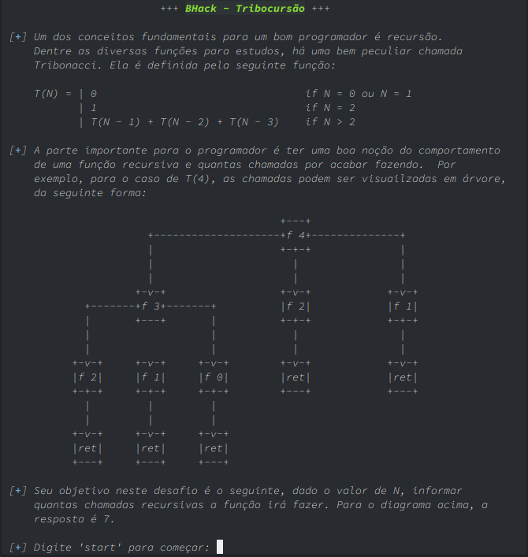
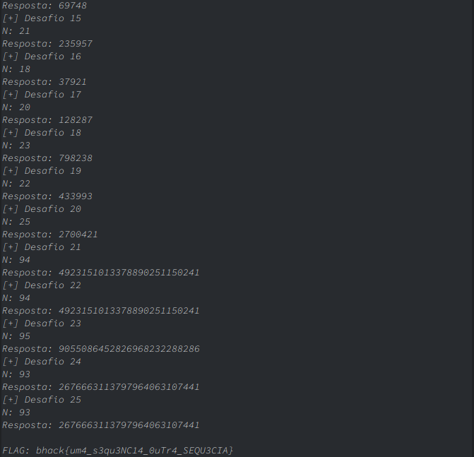

# Tribocursão

** Categoria: Programação**

# Descrição:


# Solução
Objetivo do challenge é calcular o número de chamadas recursivas que a função descrita acima faz para determinado número. Essa função é a seguinte:


A função acima é uma generalização da sequência de Fibonacci, chamada de Tribonacci. Porém existe algumas variações dessa sequência com algumas assinaturas diferentes, mas no caso do challenge a nossa sequência é a A000073 (1).

À primeira vista, a implementação da função acima é fácil. Porém quando o valor de n se torna razoavelmente grande existirá milhares chamadas recursivas, o que era praticamente impossível de calcular em questão de segundos.

Após pesquisar na internet, eu encontrei uma dedução matemática para calcular o número de chamadas recursivas para o Fibonacci e consequentemente encontrei também para a Tribonacci (2):

<p>

onde T(n) é n-ésimo elemento da sequência de Tribonacci.</p>

A função linear acima funcionava muito bem, porém quando o n chegava em valores maior que 80 a função não retornava o número de chamadas recursivas corretamente. Então, tive que pensar em outra forma de atacar o desafio.

Após uma conversa com o criador do desafio, Jeremias, resolvi que eu precisava refazer a função. E, então, resolvi criar uma função recursiva (sim!) porém usando a técnica de Memoization.

Memoization é uma técnica de otimização que consiste em armazenar o resultado da função (3).

No caso do challenge, eu construí a função de forma que ela fosse calculando todos os valores e guardado os resultados (soma e número de recursão) de cada n até o número determinado pelo desafio em um dicionário. A cada chamada recursiva a função verificava se aquele n já estava no dicionário, se estivesse então o número de chamadas recursivas era somado com o número de chamadas, armazenado pelo Memoization, daquele n e na soma da série também era feito o mesmo procedimento.

Função recursiva:
```
def tribonacci(n):
    global cont # Contador de chamadas recursivas que estava como variável global.
    global dicionario # Dicionário que armazena todos os resultados da série para diversos n's.
    global dict_cont # Dicionário que armazena todos os números de recursão para diversos n's.

    if n == 1 or n == 0: # Segundo a formula do Tribonacci
        cont += 1
        return 0
    elif n == 2: # Segundo a formula do Tribonacci
        cont += 1
        return 1
    try:
        if dicionario[n]: # Verifica se o n já foi calculado antes
            cont += dict_cont[n]
            return dicionario[n]
    except:
        pass
    cont += 1
    dicionario[n] = tribonacci(n-3) + tribonacci(n-2) + tribonacci(n-1)
    return dicionario[n]
```

O código final encontra-se nesse repositório, procure por: tribonacci_final.py

Execução do código:


# Flag:
```bhack{um4_s3qu3NC14_0uTr4_SEQU3CIA}```


# Referências:

(1) http://oeis.org/wiki/Tribonacci_numbers

(2) https://vulms.vu.edu.pk/Courses/CS201/Downloads/p60-robertson.pdf

(3) http://cangaceirojavascript.com.br/funcoes-velozes-com-memoization-pattern/
