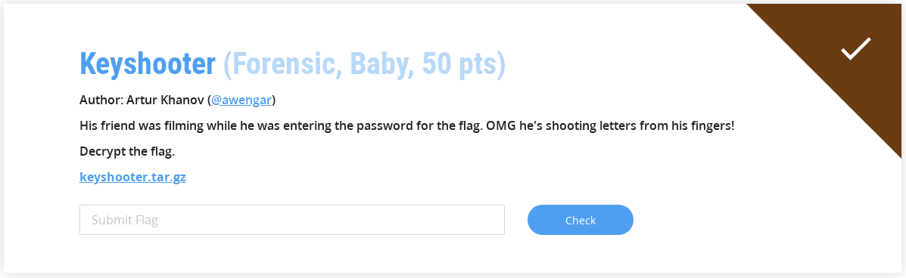
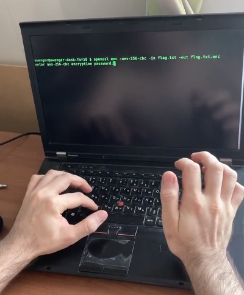

# Keyshooter

**Categoria: Forensic**

# Descrição:
> His friend was filming while he was entering the password for the flag. OMG he's shooting letters from his fingers!
> Decrypt the flag.
> 
> keyshooter.tar.gz



# Solve / Solução
Baixando o arquivo, descompactando e verificando o conteúdo, temos um arquivo chamado *"flag.txt.enc"* e um vídeo acelerado, como segue:



Trata-se do uso do openssl para encriptar o arquivo que contém a flag. Diminuindo a velocidade do vídeo fom **ffmpeg**, como segue, consegue-se observar que a senha usada para encriptar é: *mahchoudqotlzeeb*

```
ffmpeg -i speeded.mp4 -vf  "setpts=8*PTS" speeded_down.mp4
```

Usando a senha visualizada (mahchoudqotlzeeb) para decrypt o arquivo da flag, através do comando abaixo, tem-se:

```
openssl enc -d -aes-256-cbc -k "mahchoudqotlzeeb" -in flag.txt.enc -out flag.txt.out
```

Após a execução, é criado o arquivo flag.txt.out, cujo conteúdo é:

```
cybrics{L00K_4ND_F0110w}
```

Feito!


# Flag: 
```cybrics{L00K_4ND_F0110w}```
