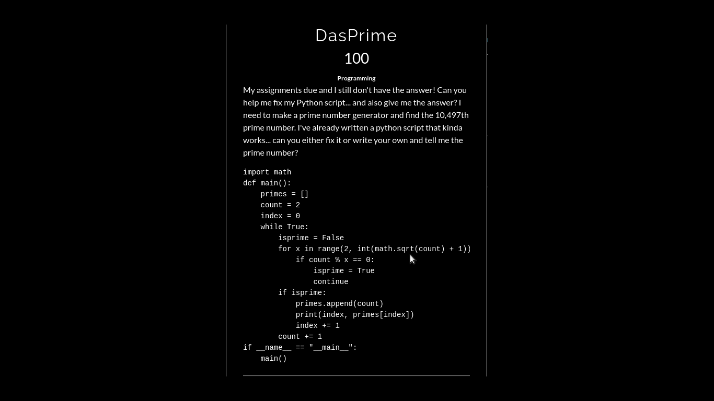
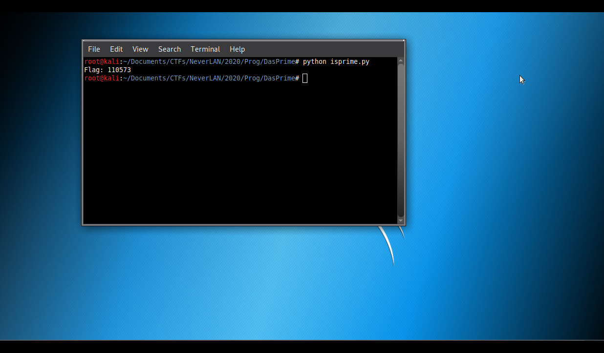

# DasPrime

**Categoria: Programação**

# Descrição:
>My assignments due and I still don't have the answer! Can you help me fix my Python script... and also give me the answer? I need to make a prime number generator and find the 10,497th prime number. I've already written a python script that kinda works... can you either fix it or write your own and tell me the prime number?

```
import math
def main():
    primes = []
    count = 2
    index = 0
    while True:
        isprime = False
        for x in range(2, int(math.sqrt(count) + 1)):
            if count % x == 0: 
                isprime = True
                continue
        if isprime:
            primes.append(count)
            print(index, primes[index])
            index += 1
        count += 1
if __name__ == "__main__":
    main()
```
>*Your flag won't be in the normal flag{flagGoesHere} syntax. Instead you're looking for a prime number.
>Autor: ZestyFE


# Solução:
Analisando a descrição, o desafio diz que foi recebico uma tarefa e essa tarefa é criar um script para contar os números primos e saber qual o número primo de posição 10,497, porém o script está com alguns erros:

Na linha 12, temos que ele verifica se a váriavel ```isprime``` é verdadeira, porém essa variável é declarada como verdadeira sempre quando o a divisão é zero, ou seja, em um range um número poderia ter mais que uma divisão inteira, o que vai na contramão da definição de números primos: "Um número primo é aquele que é dividido apenas por um e por ele mesmo"*¹.
Sabendo disso, é possível ver que a váriavel que guarda números primos, ```primes```, está armazenando números que não são primos.

Então, as modificações feitas foram:
1º - Adicionar quantas vezes aquele número foi dividido inteiramente (linha 11);

2º - Verificar se o número de divisores desse número é igual a 0, pois como o range inicia-se no número 2 e termina antes do número que será verificado - se é primo ou não - (linha 12), logo para o número ser primo ele deverá não ter nenhum divisor, já que foi removido o número 1 (todo número é dividido por 1) e também foi removido o próprio número (todo número é dividido por si mesmo), então, se o divisor for maior que 0 (é divisível por algum outro número além dele mesmo e do número 1 - definição de números primos), ele não é primo.

```
#!/usr/bin/python
#-*- coding: utf-8 -*-

import math

def main():
	primes = []
	count = 2

	while True:
		divisores = 0
		for x in range(2, int(math.sqrt(count) + 1)):
			if count % x == 0:
				divisores += 1

		if divisores == 0:
			primes.append(count)
			if len(primes) == 10497:
				print(str(primes[10496]) + "\n")
				exit()
		count += 1

if __name__ == "__main__":
    main()
```

Na linha 18, verificamos se o tamanho do array dos números primos, ```primes```, é igual a 10497, que o valor desejado do número primo a ser encontrado.

E se for, printamos o item do array no índice 10496 (já que para arrays primeiro índice é o 0).

*² (esse código pode ser encontrado aqui nesse github).



# Flag:
```110573```


*¹ (https://brasilescola.uol.com.br/o-que-e/matematica/o-que-e-numero-primo.htm).

*² (https://github.com/0x8Layer/CTF-Writeups/blob/master/NeverLan%20CTF/2020/PROG/DasPrime/isprime.py).
