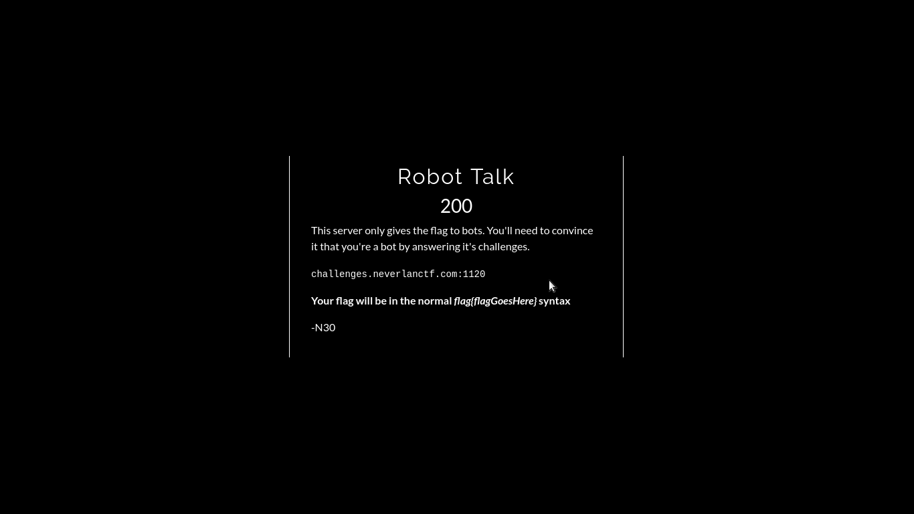
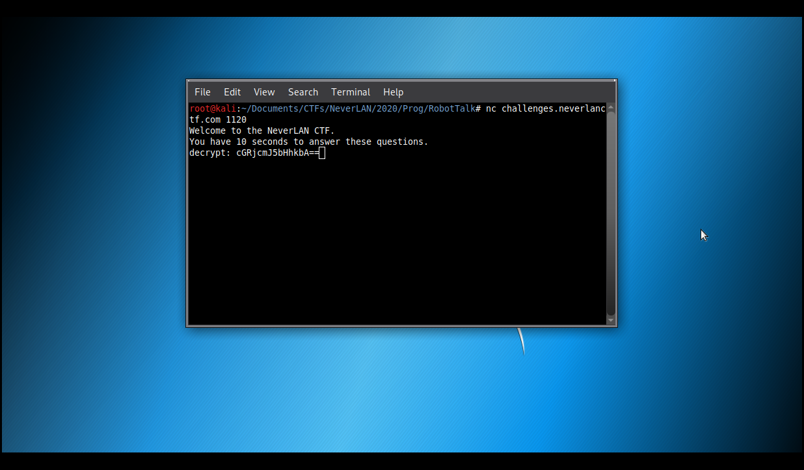
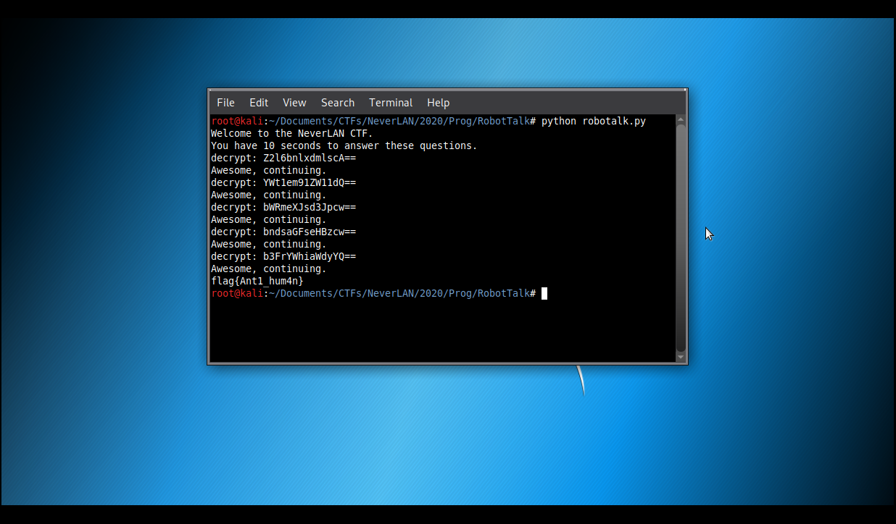

# Robot Talk

**Categoria: Programação**

# Descrição:
>This server only gives the flag to bots. You'll need to convince it that you're a bot by answering it's challenges.

>challenges.neverlanctf.com:1120

>Your flag will be in the normal flag{flagGoesHere} syntax

 >   -N30




# Solução:
A descrição nos dá um servidor para conectar e ao conectar nesse servidor, temos:


O servidor nos dá um uma mensagem em base64 para decodificar.

Então, criamos um script para conectar no servidor (linha 7 a 12), receber as mensagens (linha 14 a 17), decodificar elas (linha 18) e enviar a palavra decodificada (linha 19).

```
#!/usr/bin/python
#-*- coding: utf-8 -*-

import socket, base64

def main():
	HOST = 'challenges.neverlanctf.com'
	PORT = 1120

	tcp = socket.socket(socket.AF_INET, socket.SOCK_STREAM)
	dest = (HOST, PORT)
	tcp.connect(dest)

	data = tcp.recv(2048)
	while b"decrypt" in data:
		print(data)
		bas64 = data.split(b"decrypt:")[1]
		valor = base64.b64decode(bas64)
		tcp.send(valor)
		data = tcp.recv(2048)

	print(data)

if __name__ == "__main__":
	main()
```
*¹ (esse código pode ser encontrado aqui nesse github)

Foi utilizado um loop, pois são várias mensagens para decodificar.



# Flag:
```flag{Ant1_hum4n}```

*¹ (https://github.com/0x8Layer/CTF-Writeups/blob/master/NeverLan%20CTF/2020/PROG/Robot%20Talk/robottalk.py)
