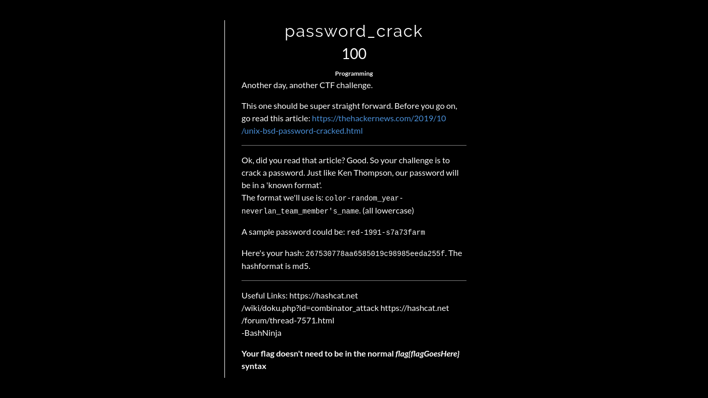
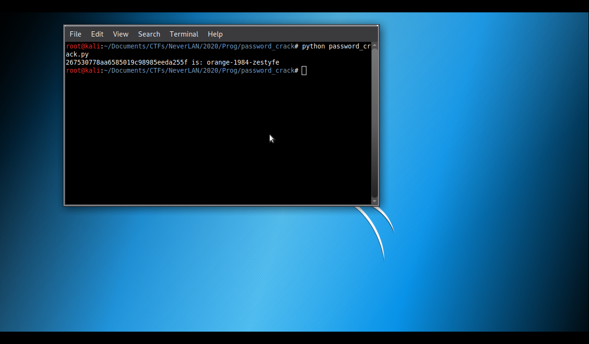

# password_crack

**Categoria: Programação**

# Descrição:
>Another day, another CTF challenge.

>This one should be super straight forward. Before you go on, go read this article: https://thehackernews.com/2019/10/unix-bsd-password-cracked.html
Ok, did you read that article? Good. So your challenge is to crack a password. Just like Ken Thompson, our password will be in a 'known format'.

>The format we'll use is: color-random_year-neverlan_team_member's_name. (all lowercase)

>A sample password could be: red-1991-s7a73farm

>Here's your hash: 267530778aa6585019c98985eeda255f. The hashformat is md5.
Useful Links: https://hashcat.net/wiki/doku.php?id=combinator_attack https://hashcat.net/forum/thread-7571.html

  >  -BashNinja

>Your flag doesn't need to be in the normal flag{flagGoesHere} syntax


# Solução:
A descrição explica o formato de como uma senha foi encriptada, nós dá também a hash para que a gente quebre ela.

Com base nessa explicação de formato, fiz o seguinte script:
```
#!/usr/bin/python
#-*- coding: utf-8 -*-

import hashlib

def main():
	HASH = "267530778aa6585019c98985eeda255f"
	colors = ["red", "blue", "yellow", "purple", "green", "black", "white", "gray", "pink", "violet", "brow", "orange", "grey", "dark", "magenta", "lime", "blank"]
	members = ["zestyfe", "durkinza", "purvesta", "s7a73farm"]

	for color in colors:
	    for year in range(1900, 2021):
	        for member in members:
	            hashencode = color + "-" + str(year) + "-" + member
	            result = hashlib.md5(hashencode)
	            hash_crack = result.hexdigest()

	            if hash_crack == HASH:
	                print(HASH + " is: " + hashencode)
	                exit()

if __name__ == "__main__":
	main()
```
*¹ (esse script pode ser encontra aqui nesse github)

Nas linhas 7, 8 e 9, definimos, respectivamente: a HASH a ser quebrada, algumas cores e o nome dos membros do time que estão organizando o CTF: NeverLAN*².

Nas linhas 11, 12 e 13, percorremos, respectivamente: as cores, os anos (usamos um range) e os membros.

E na linha 14, concatenamos todos esses valores na variável ```hashencode``` e, nas linhas seguintes, geramos um md5.

Na linha 18, verificamos se a hash gerada é igual a HASH que desejamos quebrar, e se for, printamos a HASH e a variável ```hashencode```, que contém os valores concatenados.


# Flag:
```flag{orange-1984-zestyfe}```

*¹ (https://github.com/0x8Layer/CTF-Writeups/blob/master/NeverLan%20CTF/2020/PROG/password_crack/password_crack.py)

*² (https://ctftime.org/team/32118)
