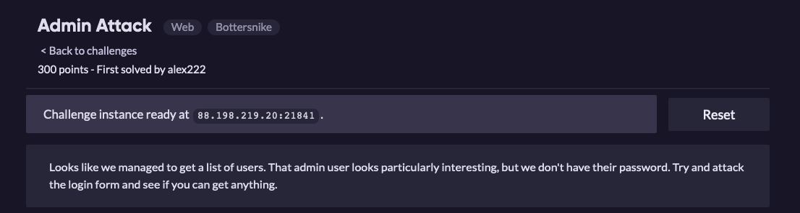
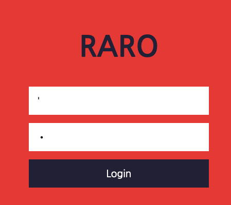
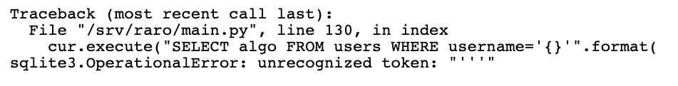
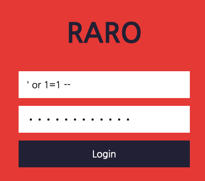
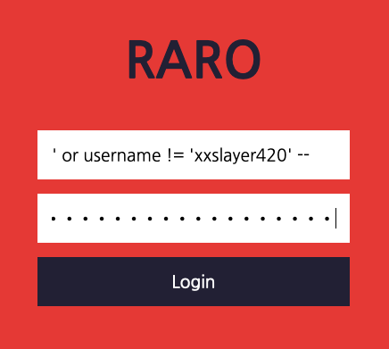

# Admin Attack

Essa é uma chall bem simples que pode ser explorada com SQL Injection.  
Assim que abrimos a URL, podemos ver uma página WEB de autenticação esperando por um usuário e senha.  

Começando pelo básico do básico, vamos verificar se o código apresenta falhas ao tratar aspas simples.

Check!! Vemos então a falha da aplicação ao tentar realizar a query e também já sabemos que o alvo utiliza SQLite.

Agora que já sabemos seu ponto fraco, é hora de explorar.    
Iremos injetar o seguinte código no campo `username` e no campo `password`.  
  
**PAYLOAD:** `' or 1=1 -- `

E então vamos ter o seguinte resultado.

Bom, pegamos um usuário que, aparentemente não é um usuário que está nos entregando a Flag. Por padrão, quando utilizamos esse injection, o SQLite irá nos retornar o primeiro resultado válido. Pensando assim, vamos tentar ignorar esse usuário e pegar o segundo resultado válido.    
Nosso payload agora irá ficar uma leve alteração, ficando assim:  
  
**PAYLOAD:** `' or username != 'xxslayer420' -- `

E como resultado iremos ter...

Trabalho feito, já podemos ver a flag que o usuário `JimmyTehAdmin` nos deu. 
   
**FLAG:** `ractf{!!!4dm1n4buse!!!}`