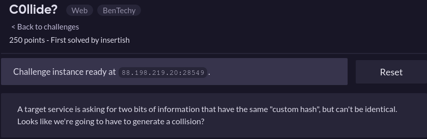
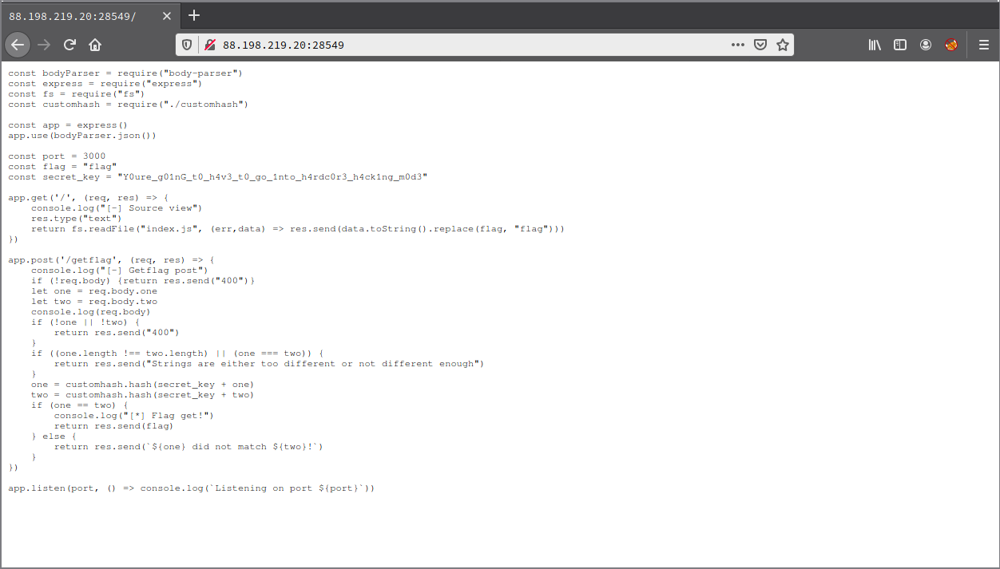

# C0llide?

**Categoria:** Web

# Descrição:
> 

# Solução
Acessando a url do desafio: http://88.198.219.20:28549/, encontrasse um código em NodeJS.



Analisando o código é possível identificar que são recebidos dois parâmetros: one e two. Esses dois parâmetros são usados em uma função chamada "customhash", que pega um salt mais os valores desses parâmetros e gera uma hash.

A ideia do desafio é conseguir fazer a função "customhash" gerar a mesma hash para valores diferentes, mas será que "a" e "b" geram a mesma hash? Em teoria não.
Então o que pensei para resolver? Enviar o mesmo valor nos dois parâmetros, porém, existia um problema:
```    
if ((one.length !== two.length) || (one === two)) {
  return res.send("Strings are either too different or not different enough")
}
```
Esse IF faz duas verificações: compara os tamanhos do valores passados anteriormente verificando se os mesmos são diferentes e compara se os dois são idênticos, caso uma dessas comparações seja verdadeira.

Então, o que eu pensei não iria para frente, pois os valores que eu iria passar teriam o mesmo valor e tipo, assim caindo em ```(one === two)```. Mas depois tive a ideia: "e se eu enviar o mesmo valor mas em forma diferente?", por exemplo: 1 e "1", são o mesmo valor (1) e de tipos diferentes mas de alguma forma isso não era aceito, então eu precisava de outra forma...

Essa outra forma foi: "1" e [1], que são o "mesmo" valor (1) e tem tipos diferentes. Vale lembrar que essas duas formas têm o mesmo tamanho!

Então:
```
curl "http://88.198.219.20:31660/getflag" -H "Content-Type: application/json" -X POST --data '{"one": "1", "two": [1]}'
ractf{Y0u_R_ab0uT_2_h4Ck_t1Me__4re_u_sur3?}
```

# Flag:
```ractf{Y0u_R_ab0uT_2_h4Ck_t1Me__4re_u_sur3?}```
