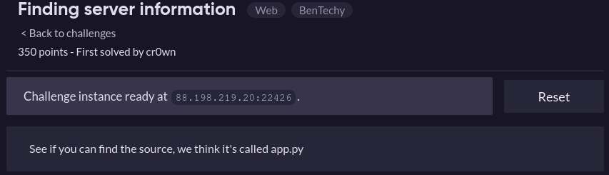
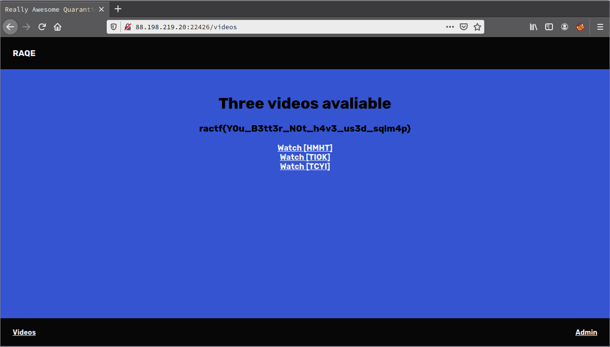
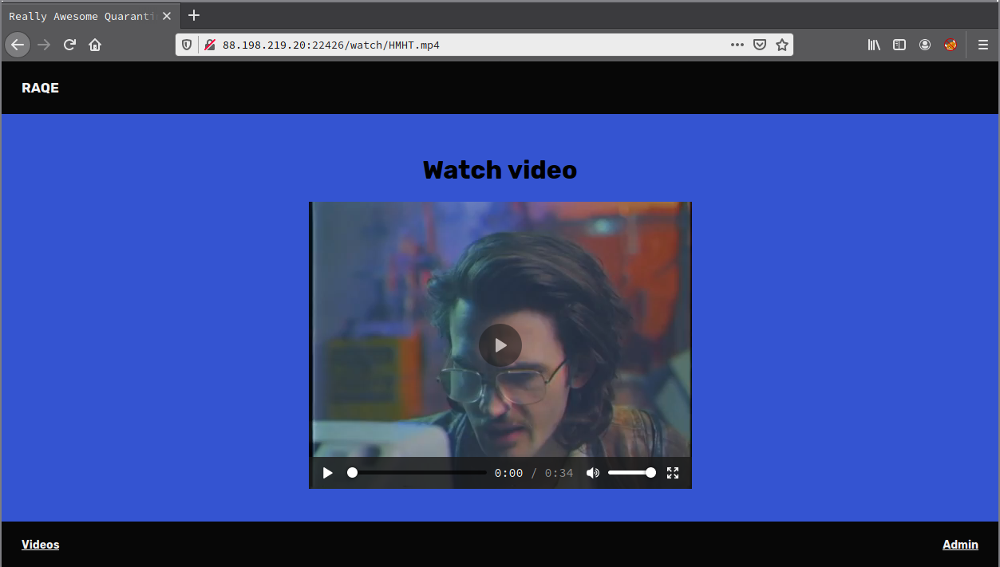
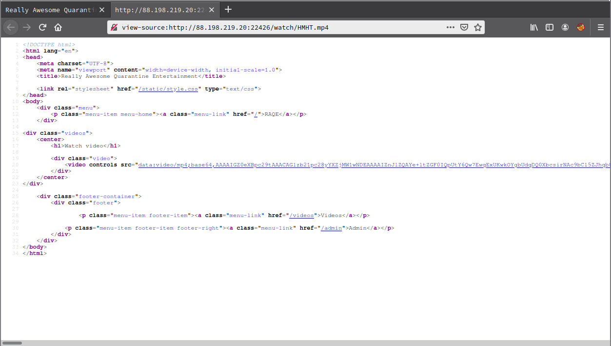
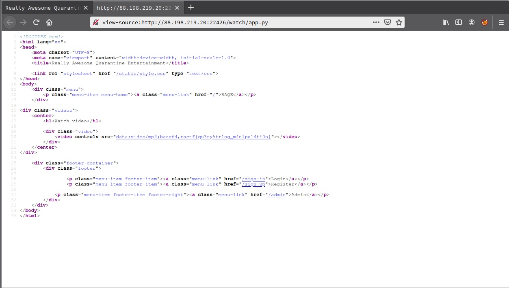

# Finding server information

**Categoria:** Web

# Descrição:
> 

# Solução
Acessando a url do desafio: http://88.198.219.20:22426/ e usando ```admin' union select 1,2,3 -- - #``` para logar, tinha uma página com alguns links para vídeos.

(A flag que aparece na imagem abaixo é flag para outro desafio resolvido anteriormente).


Acessando tais link era possível ver que um vídeo era carregado, porém ao analisar o código fonte dava pra ver que o vídeo estava completamente em base64, como se o backend estivesse pegando diretamente de algum arquivo dentro do servidor (por exemplo: cat arquivo.mp4 | base64 e colocando na página).





Então, para explorar esse desafio, a descrição falava de um arquivo fonte chamado ```app.py```, sendo assim, apenas mudei o nome do arquivo de vídeo, http://88.198.219.20:22426/watch/HMHT.mp4, "HMHT.mp4" para "app.py" e pronto, no código fonte de http://88.198.219.20:22426/watch/app.py tinha a flag.




# Flag:
```ractf{qu3ry5tr1ng_m4n1pul4ti0n}```
