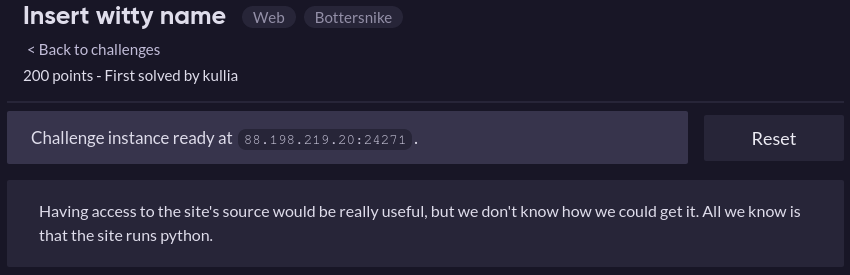
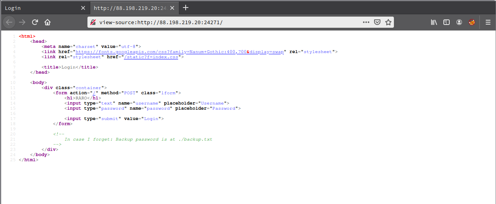
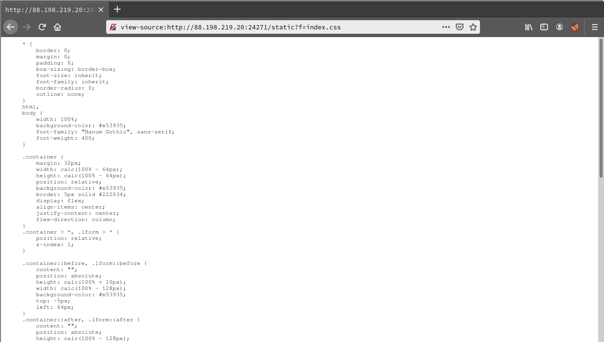
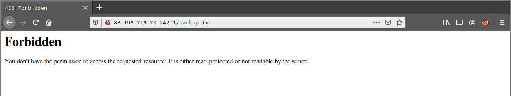
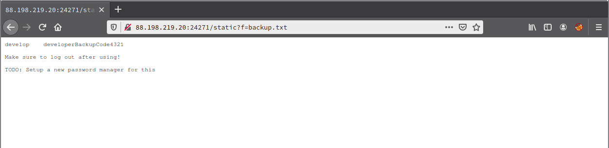

# Insert witty name

**Categoria:** Web

# Descrição:
> 

# Solução
Acessando a url do desafio: http://88.198.219.20:24271/ e acessando o código fonte dessa página, era possível encontrar algo estranho:



Nele existia um arquivo chamado "static", que ao passar algum arquivo ao parâmtro "?f=", ele retornava o conteúdo desse arquivo.
Exemplo, na imagem acima é possível ver que o static está linkado com um index.css, ao acessar isso é possível ver todo o css:



Também é possível ver que no código fonte da página principal existe o comentário:
```
<!--
    In case I forget: Backup password is at ./backup.txt
-->
```
Ao tentar acessar /backup.txt é retornado um erro 403:



Mas se usarmos "/static?f=backup.txt", é possível acessar o arquivo normalmente:



Sendo assim, com base na descrição, precisamos procurar algum arquivo python no servidor, no caso eu procurei por "main.py":
```
curl http://88.198.219.20:24271/static?f=main.py
from application import main
import sys

# ractf{d3velopersM4keM1stake5}

if __name__ == "__main__":
    main(*sys.argv)
```

# Flag:
```ractf{d3velopersM4keM1stake5}```
