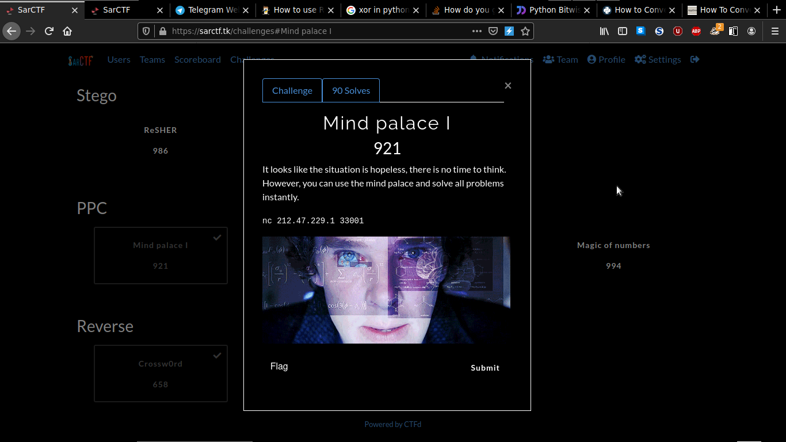
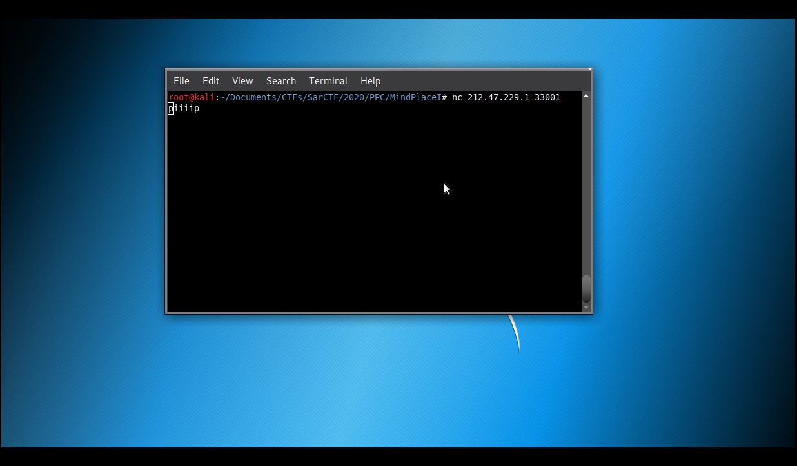
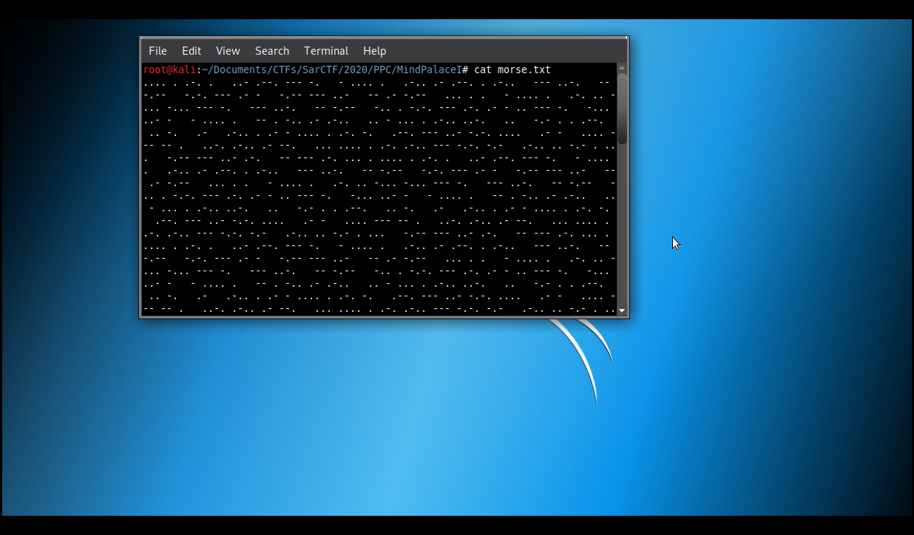
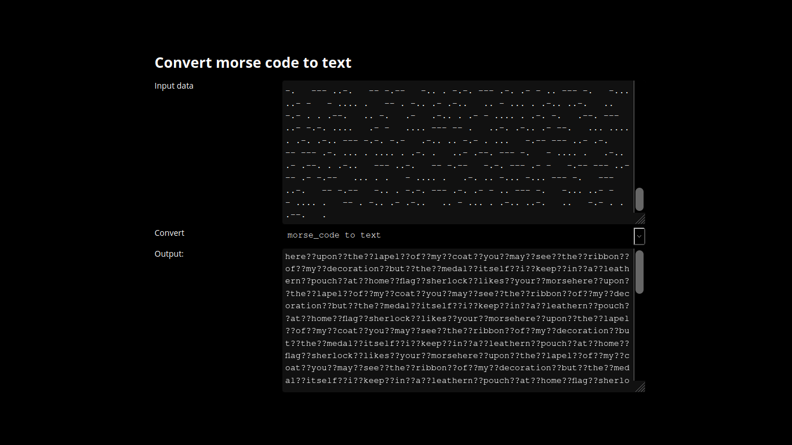

# Mind Palace I

**Categoria: Programação**

# Descrição:
>It looks like the situation is hopeless, there is no time to think. However, you can use the mind palace and solve all problems instantly.

>nc 217.47.229.1 33001


# Solução:
Ao conectar no servidor dado pela descrição, temos:



O servidor ficava mandando ```pip```, ```piiiip```.
Demorei um pouco pra entender que estava se tratando de código morse. Então, quando entendi, criei um script pra guardar todas as respostas do servidor em um arquivo.

```
#!/usr/bin/python
#-*- coding: utf-8 -*-

import socket

def main():
	HOST = '212.47.229.1'
	PORT = 33001

	tcp = socket.socket(socket.AF_INET, socket.SOCK_STREAM)
	dest = (HOST, PORT)
	tcp.connect(dest)

	valores_p = []
	valores_c = []
	c = 0
	while True:
		if c > 5000:
			break

		data = tcp.recv(1024)
		valores_p.append(data)
		c += 1

	for p in valores_p:
		if b"pip" in p:
			valores_c.append(".")
		elif b"piiiip" in p:
			valores_c.append("-")
		else:
			valores_c.append(" ")

	f = open("morse.txt", "w")
	for c in valores_c:
		f.write(c)
	f.close()

if __name__ == "__main__":
	main()
```
*¹ (esse script pode ser encontrado aqui nesse github)

A cada resposta do servidor, o script verifica se é igual a ```pip``` ou ```piiiip```, se for igual ao primeiro, o script adiciona a variável ```valores_c``` o caracter ```.```,ou se for igual ao segundo, o script adiciona a mesma variável o caracter ```-```, mas se não for nem ```pip``` e nem ```piiiip```, o script adiciona um espaço a variável.


Ao final do script é gerado um arquivo chamado ```mose.txt``` que contém todos os caracteres do código morse.

*² (esse arquivo pode ser encontrado aqui nesse github)

E usando um decoder online de morse, temos:

*³

Com isso, temos a frase:
FLAGSHERLOCKLIKESYOURMORSEHEREUPONTHELAPELOGMYCOATYOUMAYSEETHERIBBONOFMYDECORATIONBUTTHEMEDALITSELFIKEEPINALEATHERNPOUCHATHOMEFLAG

Depois de muito bater a cabeça, fui conversar com o adm e a flag era uma parte da frase acima, em minúsculo e com _ dividindo as palavras.

# Flag:
```flag{sherlock_likes_your_morse}```

*¹ (https://github.com/0x8Layer/CTF-Writeups/blob/master/SarCTF/2020/PPC/Mind%20Palace%20I/mindpalaceI_morse.py)

*² (https://github.com/0x8Layer/CTF-Writeups/blob/master/SarCTF/2020/PPC/Mind%20Palace%20I/morse.txt)

*3 (http://www.unit-conversion.info/texttools/morse-code/)
