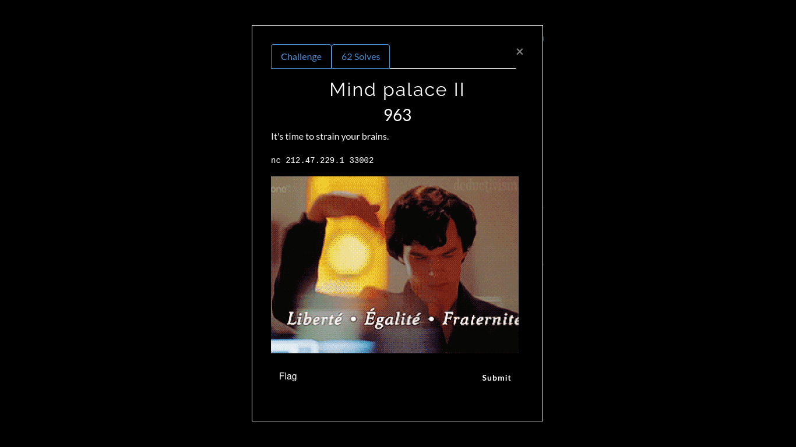

# Mind Palace II

**Categoria: Programação**

# Descrição:
>It's time to strain your brains.

>nc 217.47.229.1 33002


# Solução:
Ao conectar no servidor que o desafio nos deu, temos:


O servidor nos dá uma mensagem para decodificar e aí eu vi que era "rot_13":


Então, fiz o seguinte script:

```
#!/usr/bin/python
#-*- coding: utf-8 -*-

import socket, codecs

def main():
	HOST = '212.47.229.1'
	PORT = 33002

	tcp = socket.socket(socket.AF_INET, socket.SOCK_STREAM)
	dest = (HOST, PORT)
	tcp.connect(dest)

	data = tcp.recv(2048)
	while b"Answer" in data:
		if b"FLAG" in data:
			print(data)
			exit()

		print(data)
		palavra = data.split(b":")[1].split(b"\n")[0]
		result = codecs.encode(palavra[2::], "rot_13")
		print(result)

		if "FLAG" in result:
			print(result)
			exit()

		tcp.send(result + b"\n")
		data = tcp.recv(2048)

	print(data)


if __name__ == "__main__":
	main()
```
* (esse código pode ser encontrado aqui nesse github)

A ideia do desafio era simples:
1º - Conectar no servidor (linha 7 a 12);

2º - Receber as mensagens do servidor (linha 14);

3º - Encontrar a mensagem que o servidor deseja que a gente decodifique e decodificar a mesma(linha 21 e 22);

4º - Para decodificar a mensagem, usei a biblioteca ```codecs``` (linha 4 e 22);


# Flag:
```FLAG{Y0U_V3RY_F45T3R_CRYPT0GR4PH}```

* (github.com)
