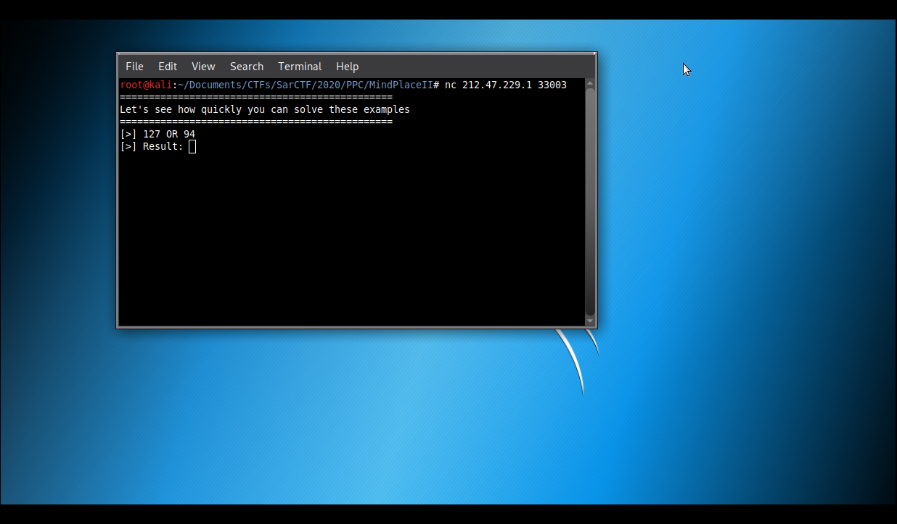
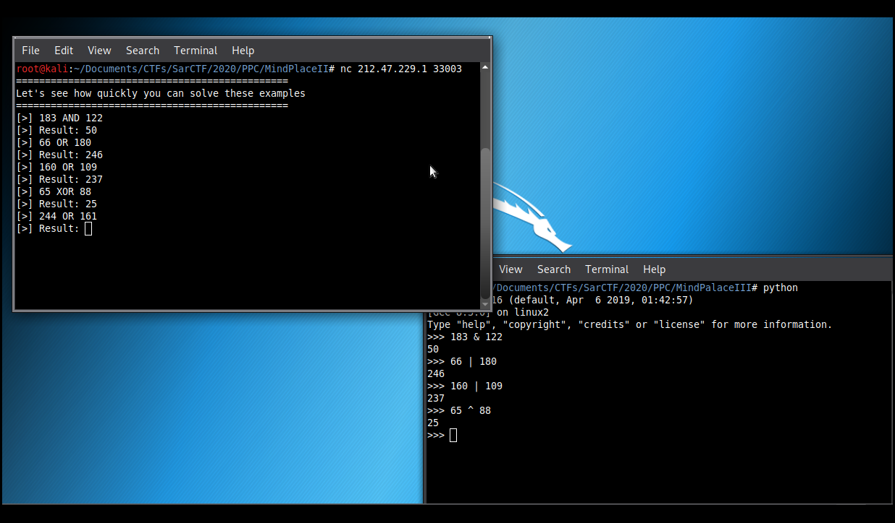
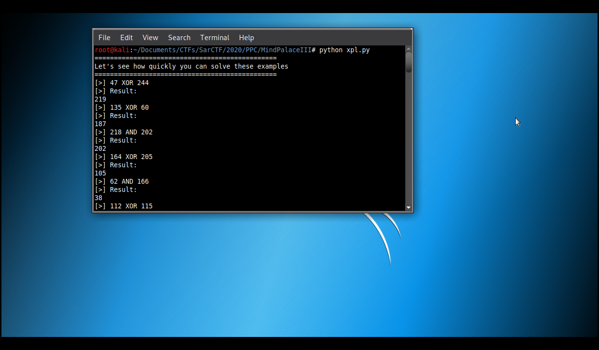
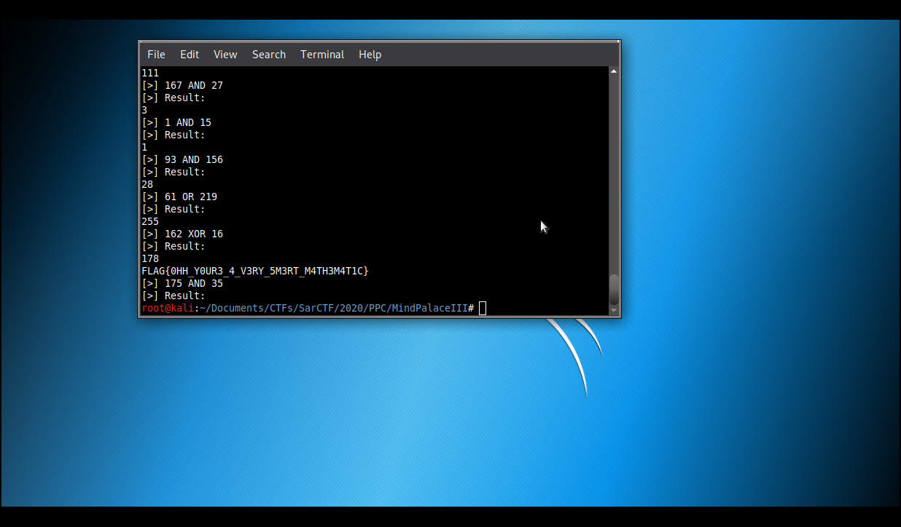

# Mind Palace III

**Categoria: Programação**

# Descrição:
>100% of brain CPU.

>nc 217.47.229.1 33003


# Solução:
Ao conectar no servidor, temos:


É possível ver que existe dois números e operadores lógicos*¹, dando a entender que você deve resolver aquele problema:


Então, criei o seguinte script:

```
#!/usr/bin/python
#-*- coding: utf-8 -*-

import socket

def main():
        HOST = '212.47.229.1'
        PORT = 33003

        tcp = socket.socket(socket.AF_INET, socket.SOCK_STREAM)
        dest = (HOST, PORT)
        tcp.connect(dest)

        data = tcp.recv(2048)
	while "FLAG" not in data:
		result = 0
		print(data)
		valores = data.split(b"[>]")[1].split(b"\n")[0].split(b" ")
		op = valores[2]

		if op == b"XOR":
			result = int(valores[1]) ^ int(valores[3])
		elif op == b"OR":
			result = int(valores[1]) | int(valores[3])
		elif op == b"AND":
			result = int(valores[1]) & int(valores[3])
		else:
			print(op)

		print(result)
		tcp.send(str(result) + b"\n")
		data = tcp.recv(2048)
	print(data)

if __name__ == "__main__":
	main()
```
*² (esse script pode ser encontrado aqui nesse github)

Explicando o script:
1º - Na linhas de 7 a 12, conectamos ao servidor;

2º - Na linha 14, recebemos as mensagens do servidor;

3º - Nas linhas 18 e 19, pego os valores de, respectivamente: números a serem comparados e do operador lógico;

4º - Nas linhas de 21 a 26, verificamos qual o operador lógico e assim realizamos as definidas operações.

5º - O ```else``` servia apenas para caso algum outro operador lógico aparecesse, aí teríamos que incrementar no código, caso acontecesse, mas não aconteceu.

6º- Na linha 31, enviamos o resultado da operação para o servidor.





# Flag:
```FLAG{0HH_Y0UR3_4_V3RY_5M3RT_M4TH3M4T1C}```

*¹ (https://python-reference.readthedocs.io/en/latest/docs/operators/index.html?highlight=logic#bitwise-operators)

*² (https://github.com/0x8Layer/CTF-Writeups/blob/master/SarCTF/2020/PPC/Mind%20Palace%20III/mindpalaceIII_oplogic.py)
