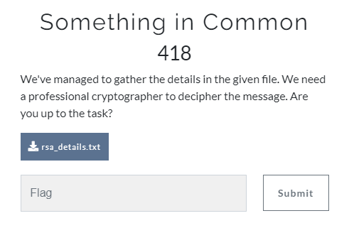
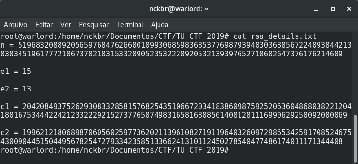
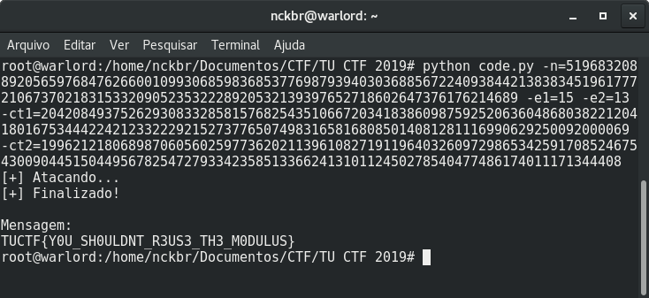

# Something in Common

**Categoria: Crypto**

# Descrição:
> We've managed to gather the details in the given file. We need a professional cryptographer to decipher the message. Are yuo up to the task?
> 
> rsa_details.txt



# Solve / Solução
Baixando o arquivo e verificando seu conteúdo, temos:



Analisando o conteúdo do arquivo, identifica-se intuitivamente que trata-se de um desafio de RSA, um dos primeiros sistemas de criptografia de chave pública, bastante  utilizado até hoje para transmissão de dados. A solução seria puramente por manipulação matemática de valores, não fosse o detalhe da omissão dos valores *c* e *e* para simples decodificação.

Dessa forma, foi necessário adaptar e empregar um algoritmo que rodasse com valores de módulo comum *n*, primeiro expoente *e1*, segundo expoente *e2*, primeiro cyphertext *ct1* e segundo cyphertext *ct2*, como segue:

```python
import argparse

from fractions import gcd

parser = argparse.ArgumentParser(description='RSA Common modulus attack')
required_named = parser.add_argument_group('required named arguments')
required_named.add_argument('-n', '--modulus', help='Modulo comum', type=long, required=True)
required_named.add_argument('-e1', '--e1', help='Primeiro expoente', type=long, required=True)
required_named.add_argument('-e2', '--e2', help='Segundo expoente', type=long, required=True)
required_named.add_argument('-ct1', '--ct1', help='Primeiro ciphertext', type=long, required=True)
required_named.add_argument('-ct2', '--ct2', help='Segundo ciphertext', type=long, required=True)

def egcd(a, b):
    if a == 0:
        return (b, 0, 1)
    else:
        g, y, x = egcd(b % a, a)
        return (g, x - (b // a) * y, y)

def modinv(a, m):
    g, x, y = egcd(a, m)
    if g != 1:
        raise ValueError('Inverso modular nao existe.')
    else:
        return x % m

def attack(c1, c2, e1, e2, N):
    if gcd(e1, e2) != 1:
        raise ValueError("Expoentes e1 e e2 devem ser primos entre si")
    s1 = modinv(e1,e2)
    s2 = (gcd(e1,e2) - e1 * s1) / e2
    temp = modinv(c2, N)
    m1 = pow(c1,s1,N)
    m2 = pow(temp,-s2,N)
    return (m1 * m2) % N

def main():
    args = parser.parse_args()
    print '[+] Atacando...'
    try:
        message = attack(args.ct1, args.ct2, args.e1, args.e2, args.modulus)
        print '[+] Finalizado!'
        print '\nMensagem:\n%s' % format(message, 'x').decode('hex')
    except Exception as e:
        print '[+] Falhou!'
        print e.message

main()
```

Com este código, a chamada para sua execução foi da forma:

```
python code.py -n=5196832088920565976847626600109930685983685377698793940303688567224093844213838345196177721067370218315332090523532228920532139397652718602647376176214689 -e1=15 -e2=13 -ct1=2042084937526293083328581576825435106672034183860987592520636048680382212041801675344422421233222921527377650749831658168085014081281116990629250092000069 -ct2=199621218068987060560259773620211396108271911964032609729865342591708524675430090445150449567825472793342358513366241310112450278540477486174011171344408
```

O resultado impresso na tela foi o seguinte, revelando a *flag*:

```
[+] Atacando...
[+] Finalizado!

Mensagem:
TUCTF{Y0U_SH0ULDNT_R3US3_TH3_M0DULUS}
```




# Flag: 
```TUCTF{Y0U_SH0ULDNT_R3US3_TH3_M0DULUS}```
