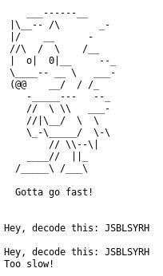

# Sonic

**Categoria: Rev**

# Descrição:
> Gotta go fast
> 
> nc chal.tuctf.com 30100


# Solve / Solução
Acessando o endereço, encontramos o seguinte extrato da página:



Identificando como Caesar Cipher, foi desenvolvido o seguinte código Python para solução:

```python

from caesarcipher import CaesarCipher
from pwn import *

def main():
    r = remote('chal.tuctf.com',30100)
    encoded = r.recv().split()[-1].decode('utf-8')
    response = None
    
    for i in range(29):
        cipher = CaesarCipher(encoded, offset=i+1)
        decoded = cipher.decoded
        r.send("{}\n".format(decoded))
        response = r.recv().split()
        print(response)

main()
```

Sua execução imprimiu a *flag*: ```TUCTF{W04H_DUD3_S0_F4ST_S0N1C_4PPR0V3S}```.


# Flag: 
```TUCTF{W04H_DUD3_S0_F4ST_S0N1C_4PPR0V3S}```
