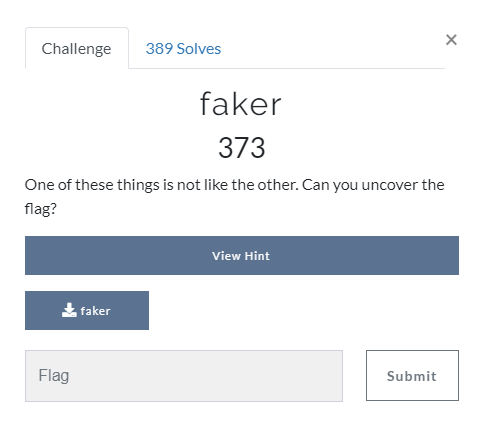

# Faker

**Categoria: Rev**

# Descrição:
> One of these things is not like the other. Can you uncover the flag?
> 
> faker



# Solve / Solução
Baixando o arquivo e descompilando-o no Ghidra, o trecho a seguir foi reescrito em C. 

```c

#include <stdio.h>

int main(){
    printFlag("\\PJ\\fC|)L0LTw@Yt@;Twmq0Lw|qw@w2$a@0;w|)@awmLL|Tw|)LwZL2lhhL0k");
    return 0;
}

void printFlag(char *param_1){
  char *__dest;
  size_t sVar1;
  int local_30;
  
  __dest = (char *)malloc(0x40);
  memset(__dest,0,0x40);
  strcpy(__dest,param_1);
  sVar1 = strlen(__dest);
  local_30 = 0;
  while (local_30 < (int)sVar1) {
    __dest[local_30] = (char)((int)((((int)__dest[local_30] ^ 0xfU) - 0x1d) * 8) % 0x5f) + ' ';
    local_30 = local_30 + 1;
  }
  puts(__dest);
  return;
}
```

Sua execução imprimiu a *flag*: ```TUCTF{7h3r35_4lw4y5_m0r3_70_4_b1n4ry_7h4n_m3375_7h3_d3bu663r}```.


# Flag: 
```TUCTF{7h3r35_4lw4y5_m0r3_70_4_b1n4ry_7h4n_m3375_7h3_d3bu663r}```
