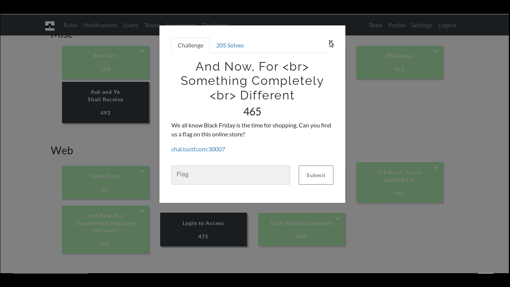
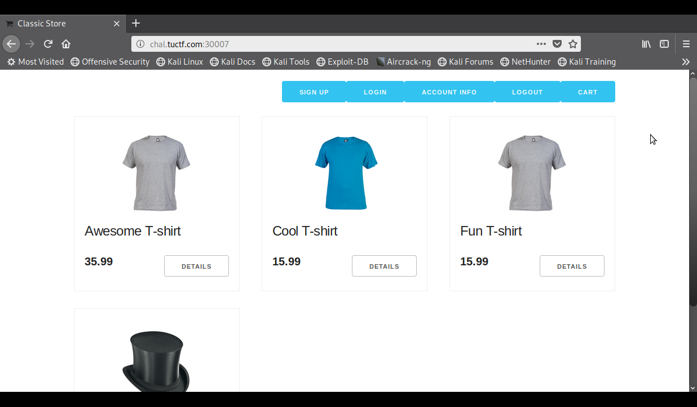
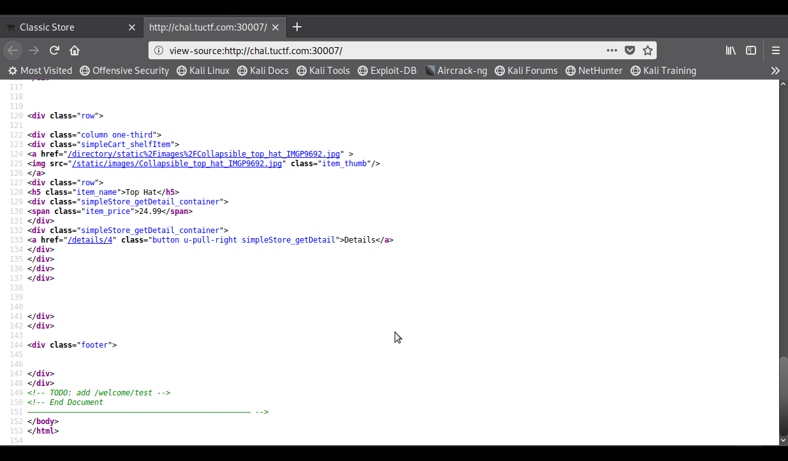
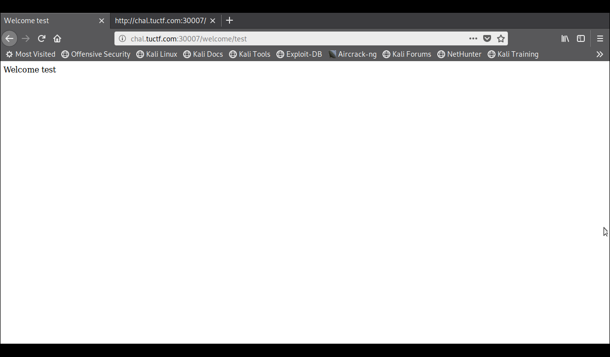
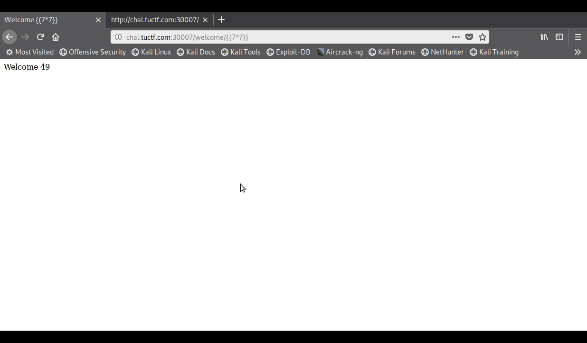
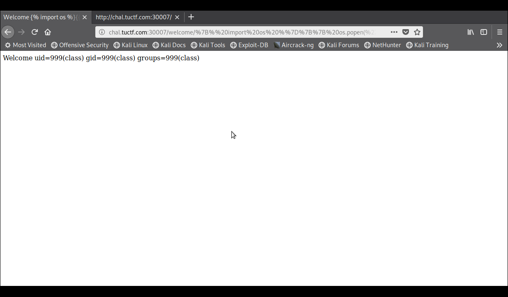
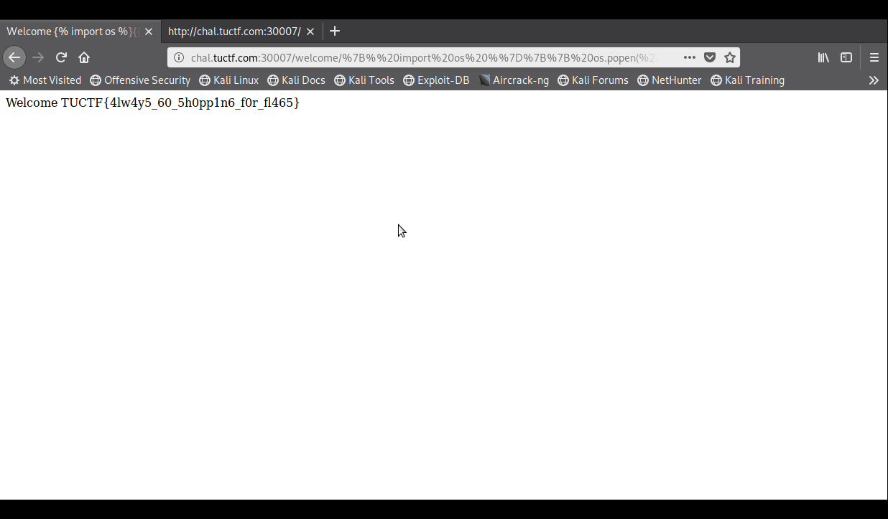

# And Now, For \<br> Something Completely \<br> Different

**Categoria: Web**

# Descrição:
>We all know Black Friday is the time for shopping. Can you find us a flag on this online store?

>chal.tuctf.com:30007


# Solução:
Acessando o link:

Analisando o código fonte encontramos um diretório:

E, acessando o "/welcome/test", temos:

Depois de testar alguns paylods, cheguei ao Server-Side Template Injection (SSTI), com o payload {{7*7}}:

E descobri que estava rodando Tornado no servidor, pois em uns dos payloads que eu testei me retornou um erro com o path do Tornado e assim procurei outros payloads para o Tornado.

Usei: {{ os.popen("id").read() }}

E assim, obti a flag, com o payload: {{ os.popen("cat flag.txt").read() }}


# Flag:
```TUCTF{4lw4y5_60_5h0pp1n6_f0r_fl465}```

