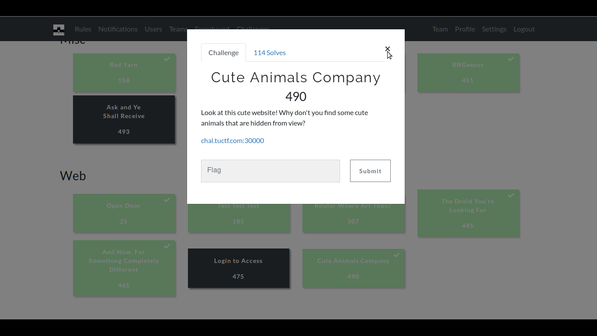
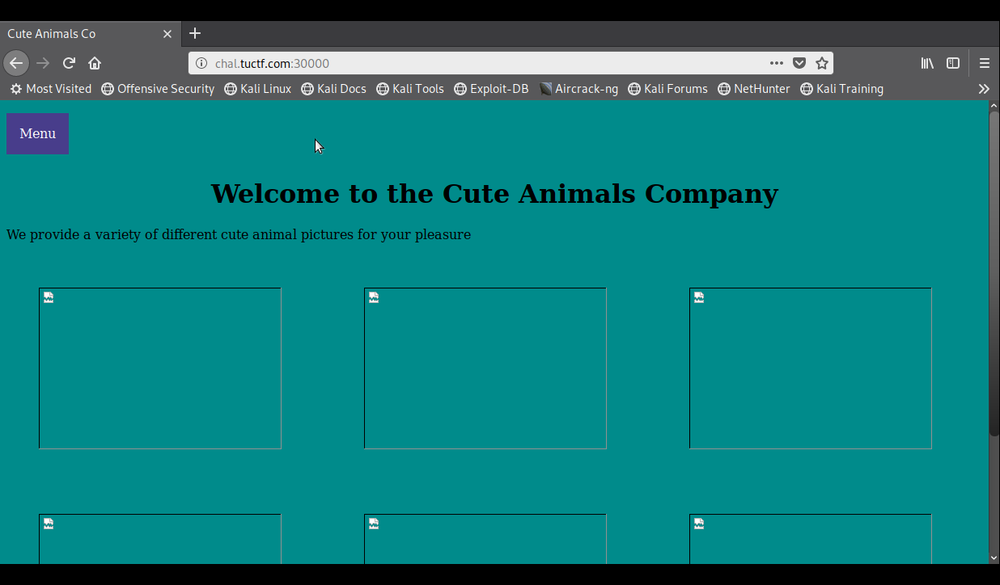
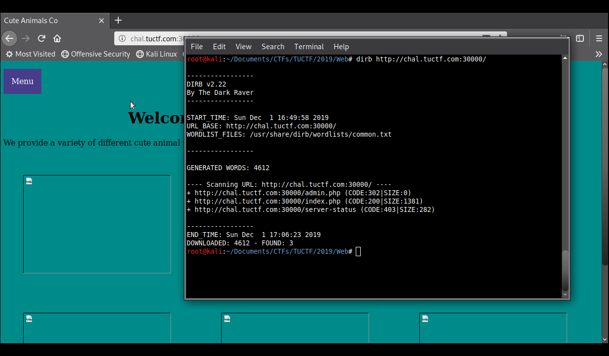
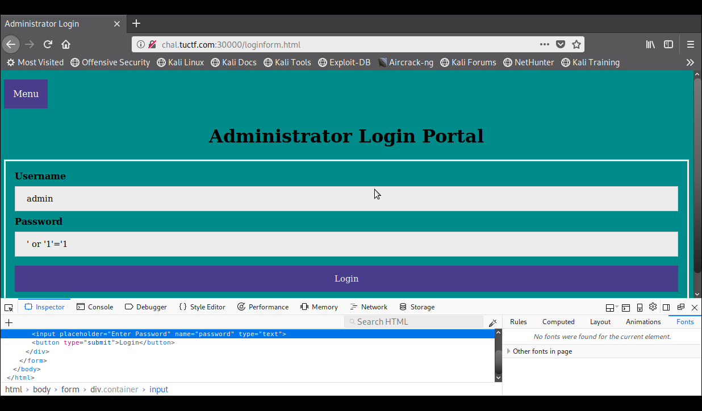
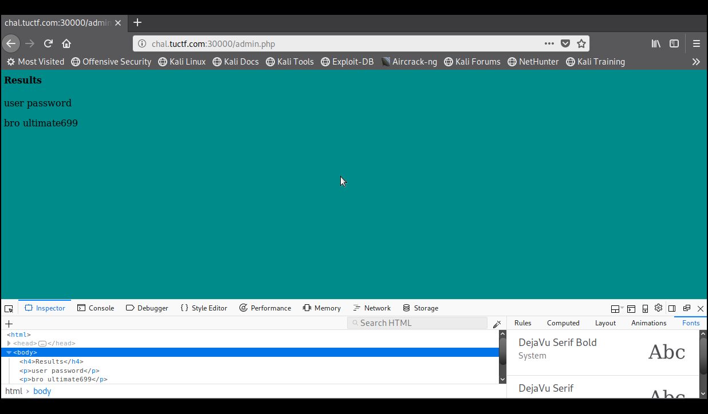
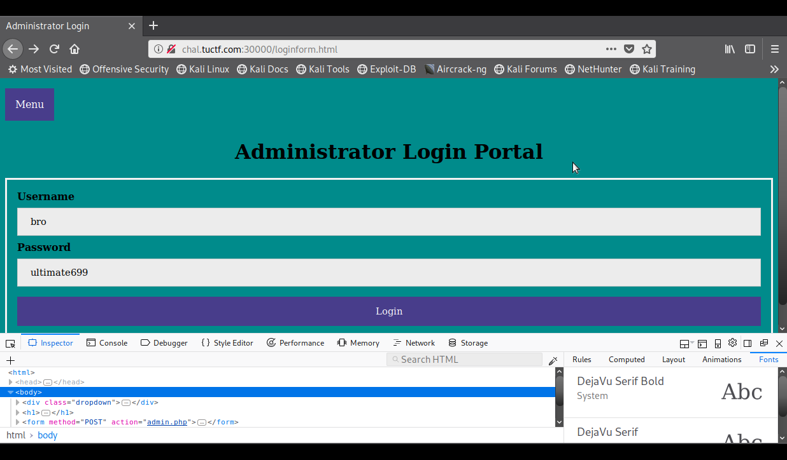
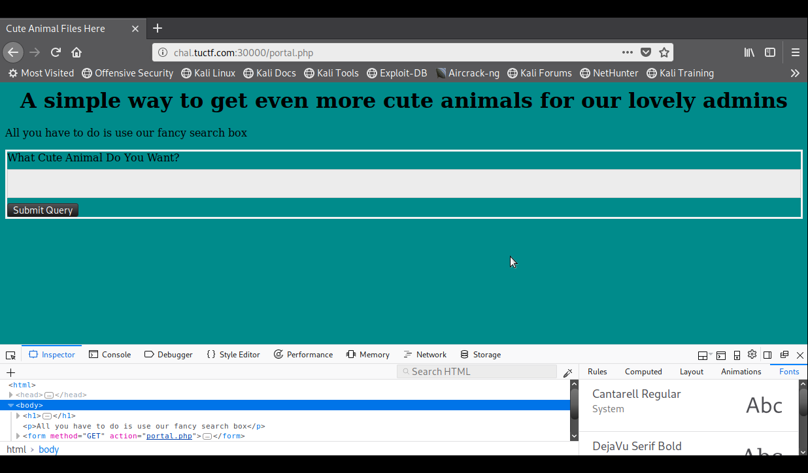
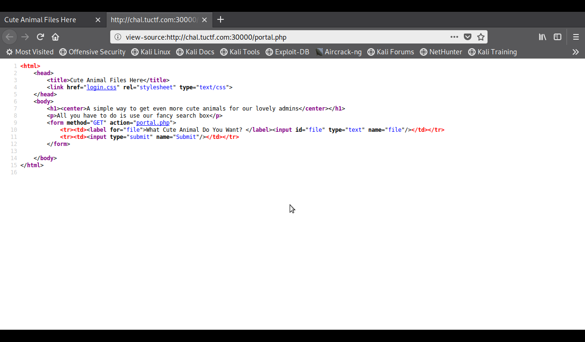
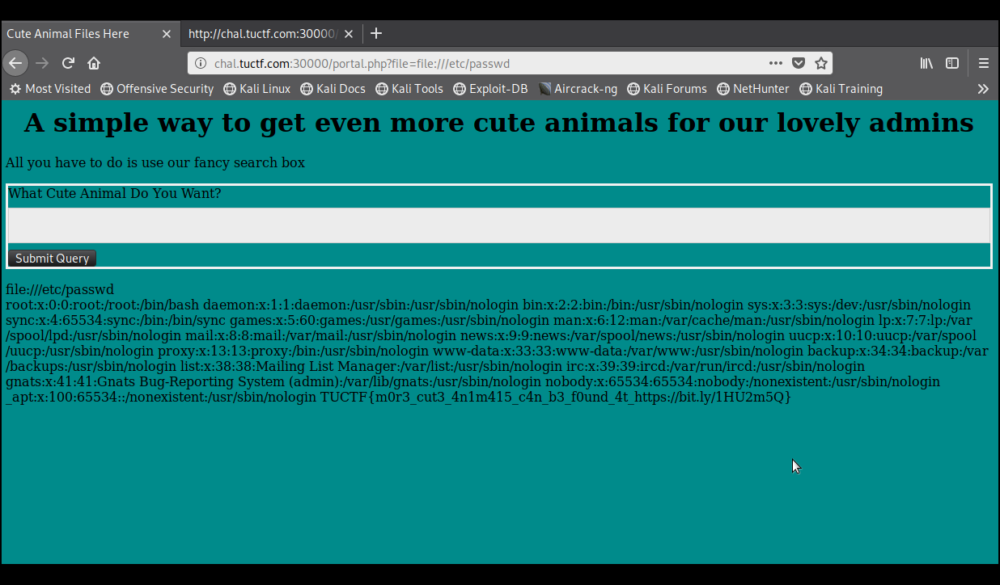

# Cute Animals Company

**Categoria: Web**

# Descrição:
>Look at this cute website! Why don't you find some cute animals that are hidden from view?

>chal.tuctf.com:30000


# Solução:
Acessando o link temos:

Porém não obtivemos muitos resultados, então rodei o dirb em cima do site:

Ao acessar "/admin.php", somos redirecionados para "/loginform.html", então tentei um sql injection no formulário:

Na próxima página, é possível ver um login "bro/ultimate699":

Logando com essas credenciais:

Redirecionados para "/portal.php":

No código fonte de "/portal.php" é possível ver um formulário com um parâmetro "file" que seria enviado via GET:

Então, passando "file" como parâmetro e testando alguns payloads, me deparei com um LFI e explorei esse LFI com file:///etc/passwd e assim obtendo a flag:


# Flag:
```TUCTF{m0r3_cut3_4n1m415_c4n_b3_f0und_4t_https://bit.ly/1HU2m5Q}```
