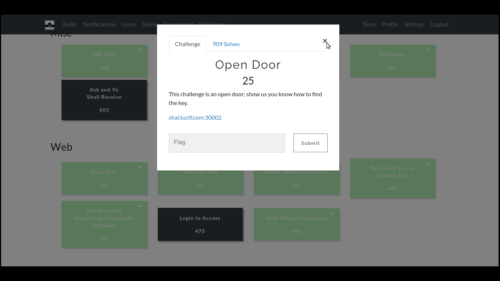
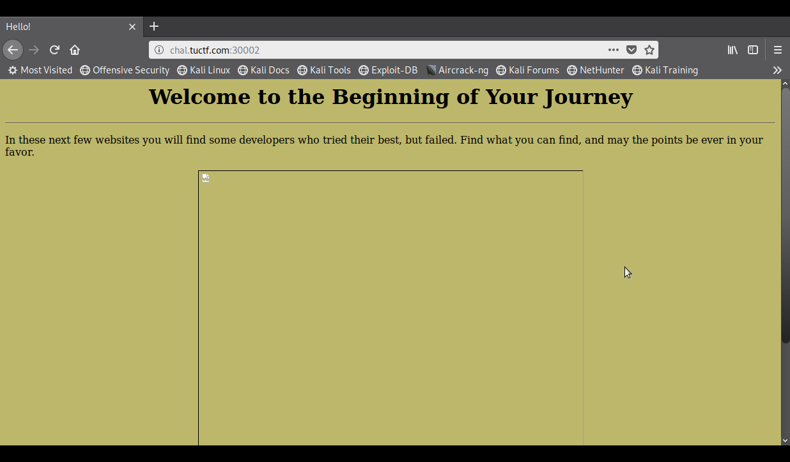
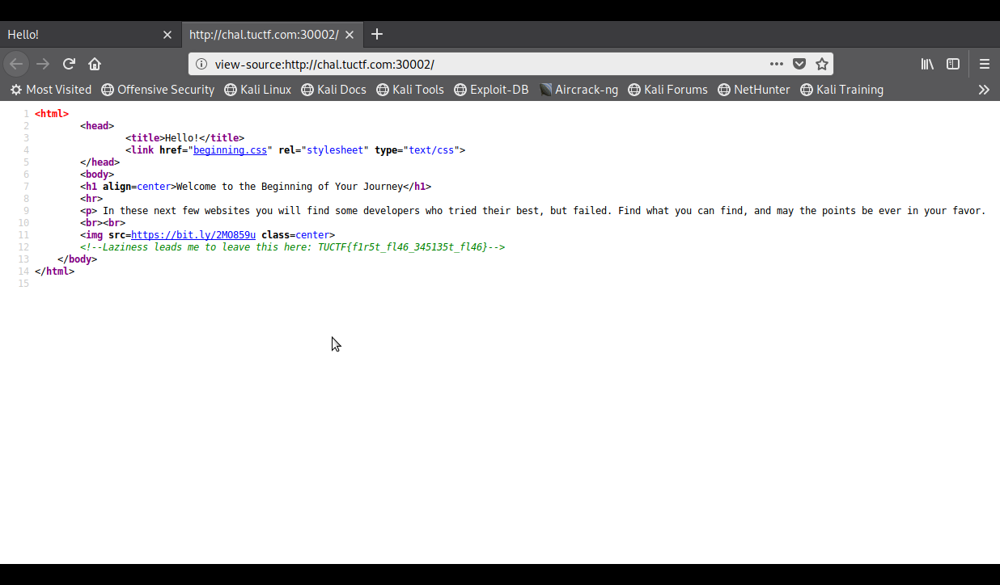

# OpenDoor

**Categoria: Web**

# Descrição:
>This challenge is an open door; show us you know how to find the key.

>chal.tuctf.com:30002



# Solução:
Acessando a página web, temos:

E analisando o código fonte foi possível encontrar a flag:


# Flag:
```TUCTF{f1r5t_fl46_345135t_fl46}```
