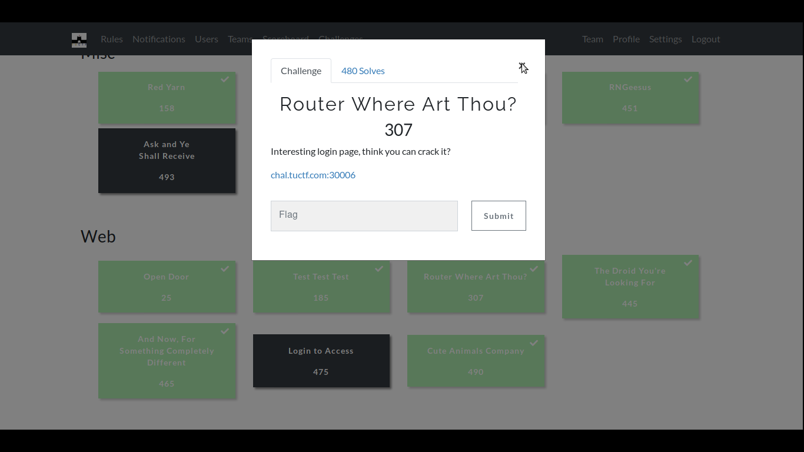
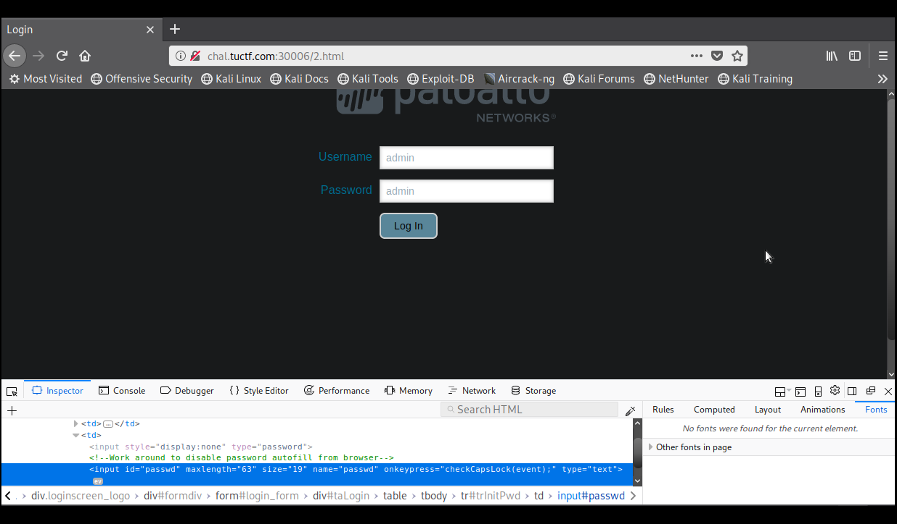
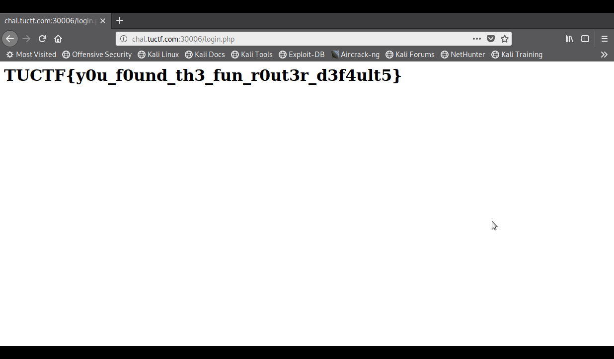

# Router Where Art Thou?

**Category: Web**

# Descrição:
>Interesting login page, think you can crack it?

>chal.tuctf.com:30006



# Solução:
Como o nome do desafio fala sobre roteador e a descrição sobre invadir uma página de login, nada melhor que tentar algumas senhas "defaults" dos roteadores.

Comecei por "admin/admin":

E, então, aqui está a flag:


# Flag:
```TUCTF{y0u_f0und_th3_fun_r0ut3r_d3f4ult5}```
