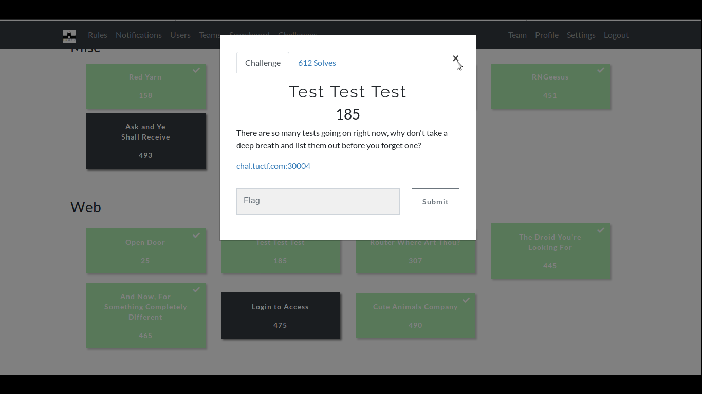
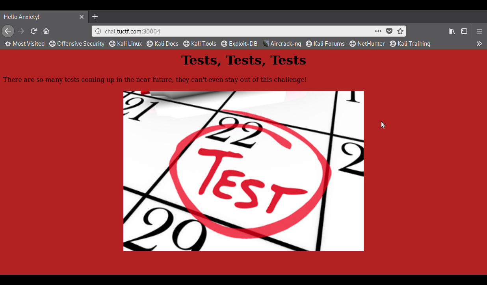
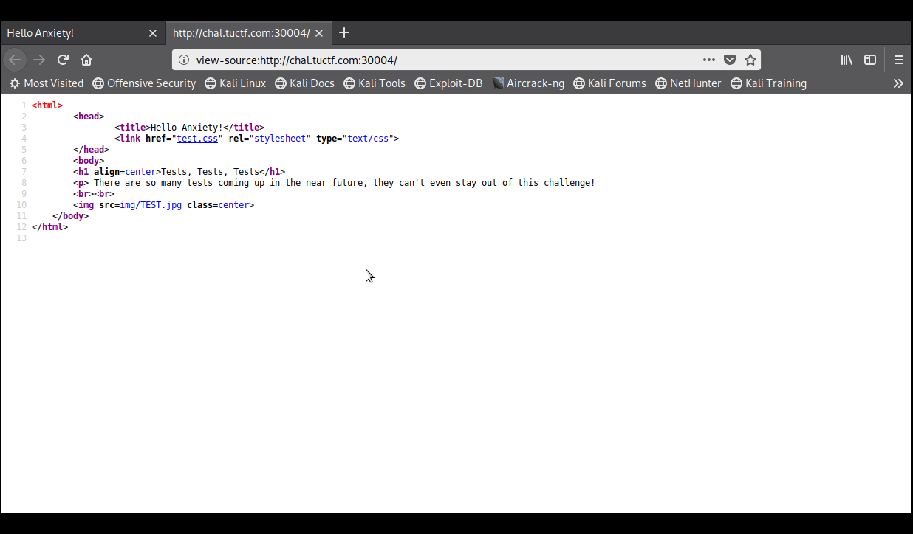
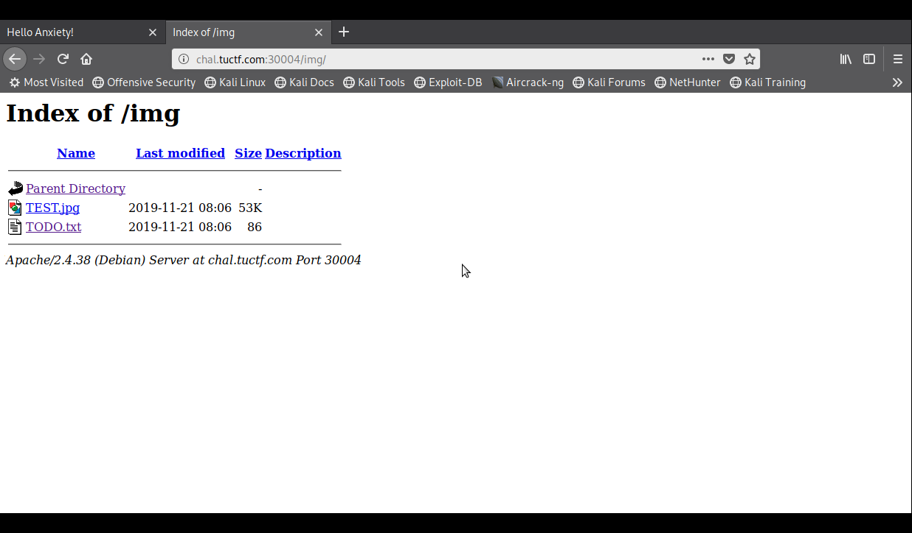
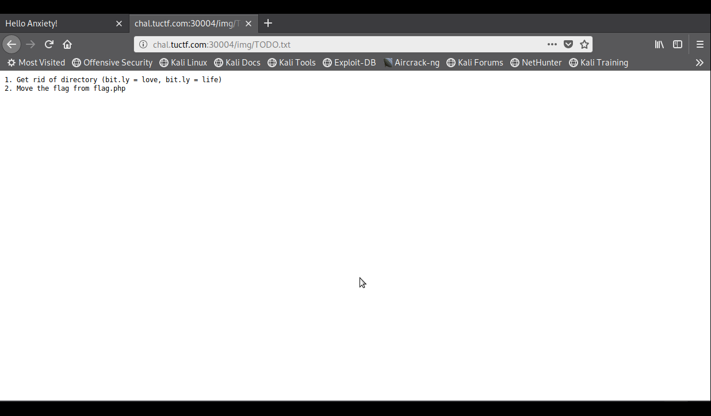
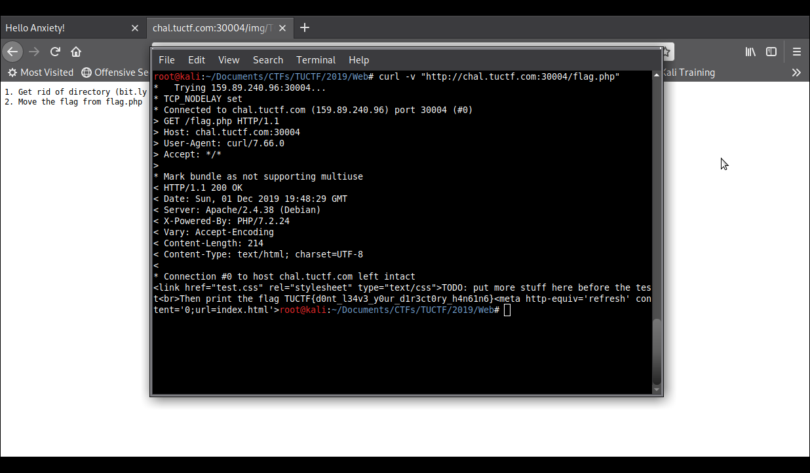

# Test Test Test

**Categoria: Web**

# Descrição:
>There are so many tests going on right now, why don't take a deep breath and list them out before you forget one?

>chal.tuctf.com:30004


# Solução:
Ao acessar o site, temos a seguinte página:

Analisando o código fonte é possível ver um diretório chamado "/img":

Acessando esse diretório encontramos alguns arquivos:

E entrando em "/img/TODO.txt", tem-se:

E, então, usaremos o cURL para obter a flag, pois ao acessar ela somos redirecionados imediatamente para a página principal:
>curl -v "http://chal.tuctf.com:30004/flag.php"


# Flag:
```TUCTF{d0nt_l34v3_y0ur_d1r3ct0ry_h4n61n6}```
