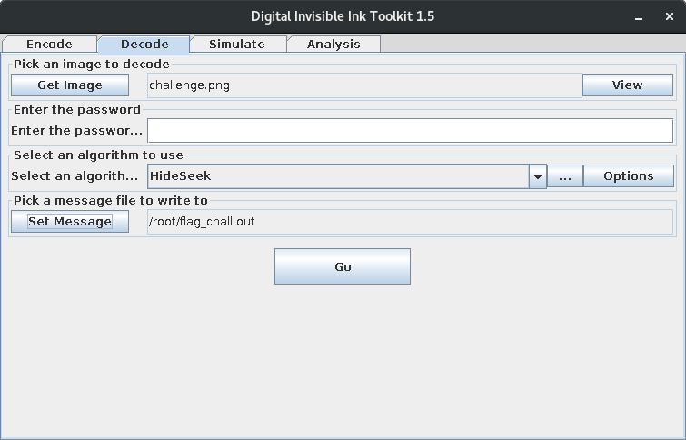

# Santa's letter

**Categoria: Forensics**

# Descrição:
> It seems that Santa may have used some Invisible Ink to write this letter... he is surely playing Hide&Seek.
> 
> Files: challenge.png

# Solução

Uma vez baixado o arquivo no link da descrição acima, encontramos a imagem *challenge.png* mostrada a seguir:


Logo, como havia a dica *Hide&Seek* na descrição, nós utilizamos o DIIT (Digital Invisible Ink Toolkit) 1.5 (veja mais sobre ele [aqui](http://diit.sourceforge.net/)) para tentar decodificá-lo através do algoritmo *HideSeek*, como mostrado na imagem a seguir:



Na sequência, nós simplesmente checamos o conteúdo do arquivo *flag_chall.out* como segue:

```bash
cat /root/flag_chall.out
```

A execução do comando imprimiu a *flag* a seguir:```X-MAS{NOBODY:_SANTA:Hyvää joulua!}```.


# Flag: 
```X-MAS{NOBODY:_SANTA:Hyvää joulua!}```
