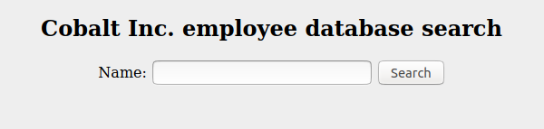
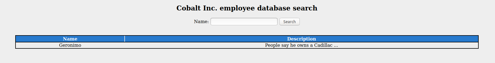
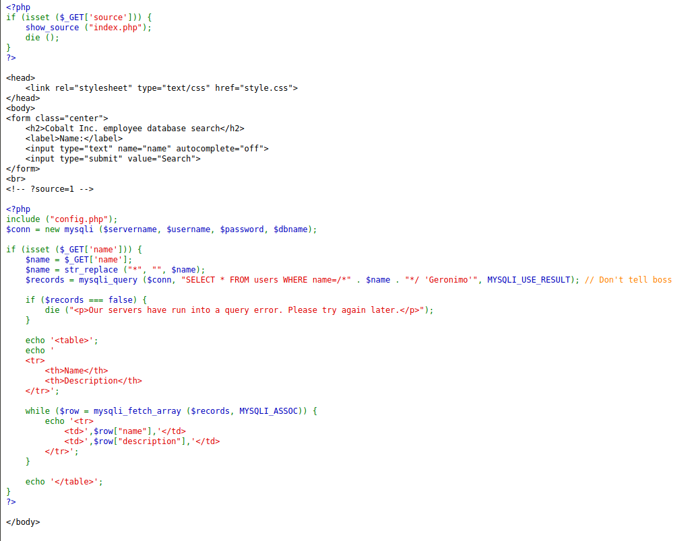
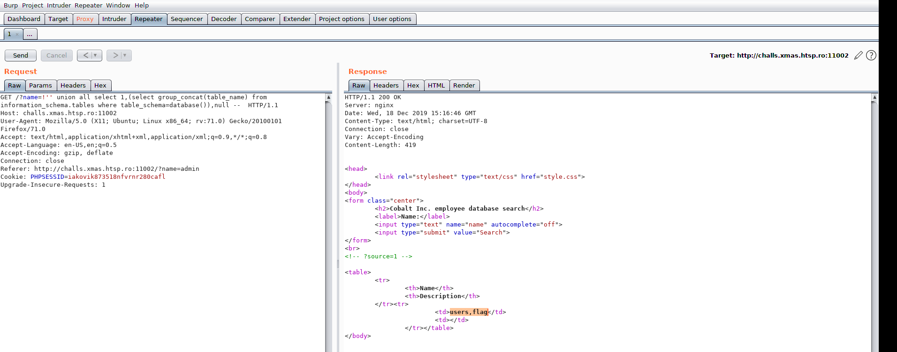
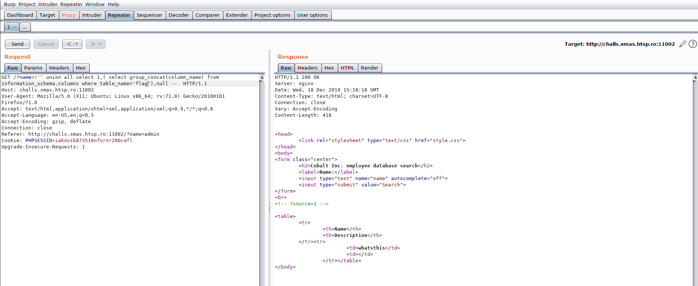
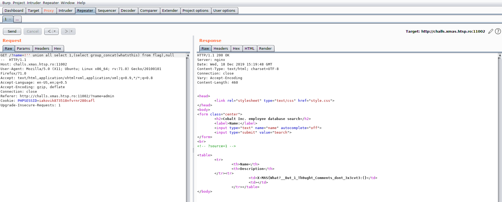

# Execute No Evil

**Categoria:** Web

# Descrição:

(1) New Message: "Hey dude. So we have this database system at work and I just found an SQL injection point. I quickly fixed it by commenting out all the user input in the query. Don't worry, I made the query so that it responds with boss's profile, since he is kind of the only person actively using this database system, and he always looks up his own name, lol. Anyway, guess we'll go with this til' the sysadmin comes and fixes the issue."

Huh, so hear no evil, see no evil, ... execute no evil?

Remote server: http://challs.xmas.htsp.ro:11002
Author: Milkdrop


# Solução
Primeiro vamos acessar nosso alvo web para vermos o que ele nos retorna.



Temos então uma página que realiza busca no banco de dados com o nome dos empregados. Legal, isso já me cheira a SQL Injection.

Depois de inserir alguns valores aleatórios e alguns tipo de Injections, reparei que o resultado é sempre o mesmo. Algo de errado não está certo!!



Analisando o código fonte da página, encontrei um comentário que indica um parâmetro  `source` via `GET` que pode ser passado. A URL ficou assim `http://challs.xmas.htsp.ro:1102/?source` e o retorno foi esse:



O código é bem simples de entender, o que facilita bastante o nosso code review. Tudo o que digitamos até então na pesquisa, está caindo dentro do comentário na query, por isso temos sempre o mesmo resultado.

Bom, o que temos de fazer então já está explícito... como vamos fazer? Vamos descobrir agora!

Apesar da regra ser simples, o bypass está protegido contra alguns métodos PHP de encode e também o caracter `*` não funciona por causa do replace. Isso complicado um pouco nossa vida, mas nada é impossível. É hora de mudar a estratégia e pensar um pouco diferente.

Segundo a documentação do MySQL (vide https://dev.mysql.com/doc/refman/8.0/en/comments.html), podemos ver esse trecho de código que parece ser bem interessante: `/*! MySQL-specific code */`.

Na pesquisa se inserirmos um`!'`, será retonado a mensagem `Our servers have run into a query error. Please try again later`. Isso significa que conseguimos inserir um trecho de código que não virou comentário. Agora tudo ficou mais fácil e podemos inserir pesquisas dentro do banco de dados.

Executei de executear alguns `UNION ALL SELECT ....`, cheguei a conclusão de que preciso de 3 colunas no nosso `UNION`, então vamos agora ver quais tabela há nesse database.
>Payload: !'' union all select 1,(select group_concat(table_name) from information_schema.tables where table_schema=database()),null --



Legal, temos duas tabelas, `users` e `flag`. Vamos ver primeiro quais colunas existem na tabela `flag`, que é um nome mais intuitiva para o nosso propósito.
>Payload: !'' union all select 1,( select group_concat(column_name) from information_schema.columns where table_name='flag'),null --



Temos uma coluna chamada `whatsthis`. Algo me diz que a flag pode estar aqui, então vamos ver o que tem nela. 
> Payload: !'' union all select 1,(select group_concat(whatsthis) from flag),null --



Eureka! Flag capturada. Pode ir para o bar comemorar, te espero lá.

Espero que esse writeup tenha sido útil.

Abs...

# Flag: 
```X-MAS{What?_But_1_Th0ught_Comments_dont_3x3cvt3:(}```
