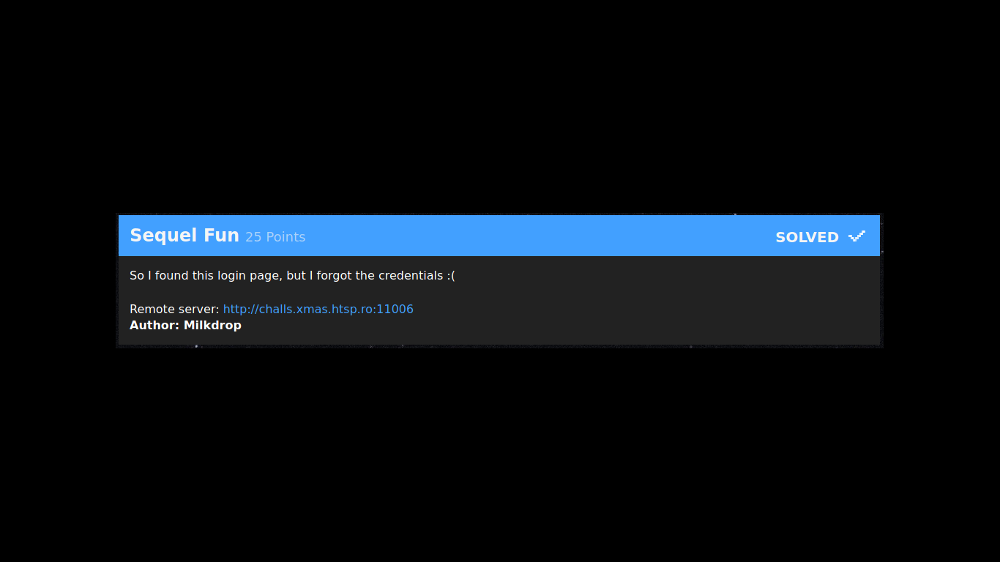
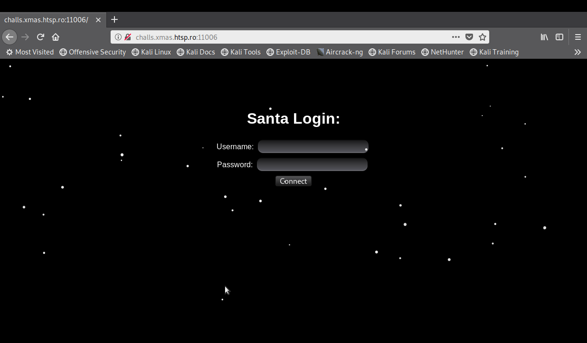
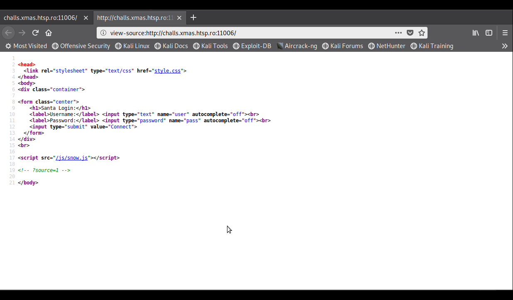
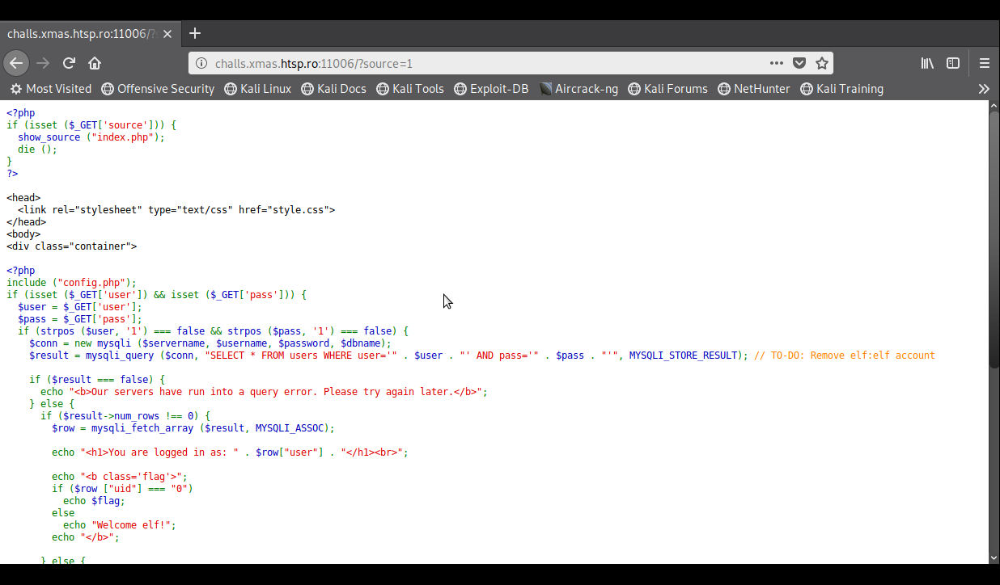
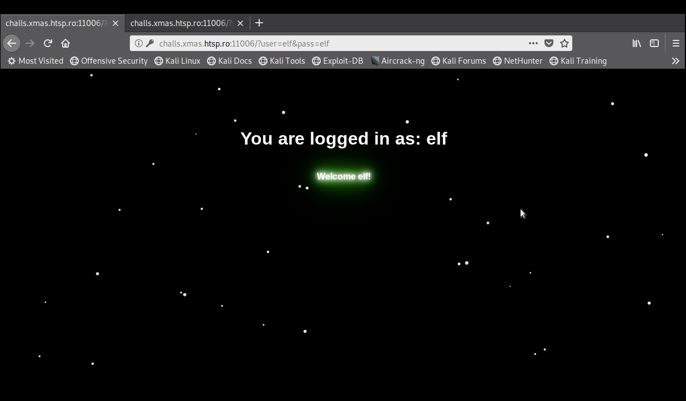
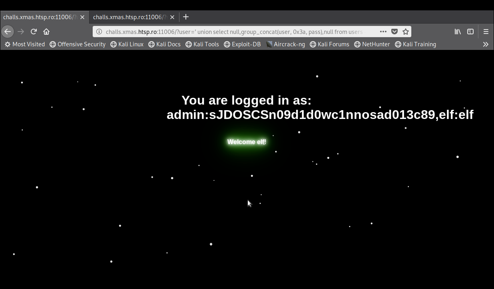
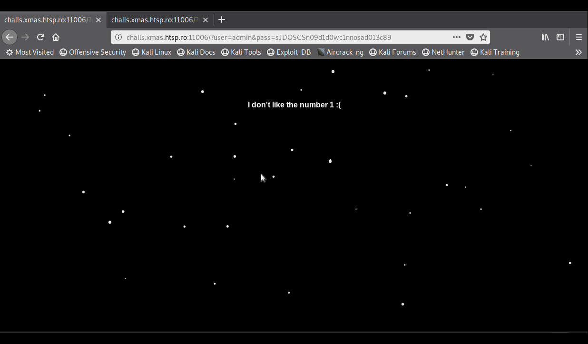
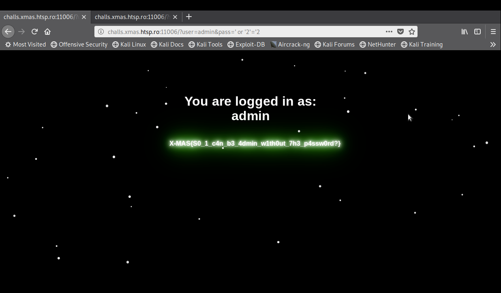

# Sequel Fun

**Categoria:** Web

# Descrição:
>So I found this login page, but I forgot the credencials :(

>Remote server: http://challs.xmas.htsp.ro:110066

>Autor: Milkdrop


# Solução:
Acessando o site, como é dito na descrição do desafio, nos deparamos com uma página de login:


Olhando o código fonte, temos um "/?source=1" comentado:


Acessando "/?source=1", temos o código fonte do "index.php", onde nós encontramos o formulário de login e uma consulta SQL:


No código fonte acima, vale analisar alguns pontos do código:

1º - A função strpos do PHP está verificando se há o carácter "1" nos valores passados como user e pass;

2º - Existe uma consulta SQL para o login, porém ela está vulnerável a SQL Injection;

3º - Também existe um comentário no PHP, na frente da query SQL, que fala sobre remover uma conta "elf:elf" (user:pass).


Logo, o planejamento para explorar esse desafio foi o seguinte:

1º - Logar como "elf", para ter uma ideia de como é a requisição quando a query é aceita;

2º - Explorar o SQL Injection, porém sem usar querys que contenham o carácter "1";

3º - Verificar quais usuários diferentes de "elf" existem e logar neles, pois possívelmente terão mais privilégios que o usuário "elf".

Logando como "elf", temos:


A exploração do SQL Injection era bem simples, apenas um SQL Injection UNION BASED:

Payload: ```"http://challs.xmas.htsp.ro:110066/?user=' union select null,group_concat(user, 0x3a, pass),null from users -- &pass="```


Porém, ao logar como "admin", obtivemos o erro "I don't like numer 1 :(":


Ou seja, não tem como logar diretamente no usuário "admin" pois a senha dele tem o carácter "1", então vamos tentar uma segunda forma.

A segunda forma era bem mais simples do que o UNION BASED, na verdade, se chutassemos "admin" como usuário e testassemos uma "query" booleana, teríamos conseguido logar:

Payload: ```"http://challs.xmas.htsp.ro:11006/?user=admin&pass=' or '2'='2"``` (observe: sem usar o carácter "1")


# Flag:
```X-MAS{S0_1_c4n_b3_4dmin_w1th0ut_7h3_p4ssw0rd?}```
